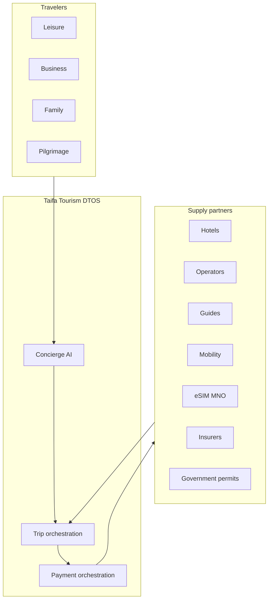
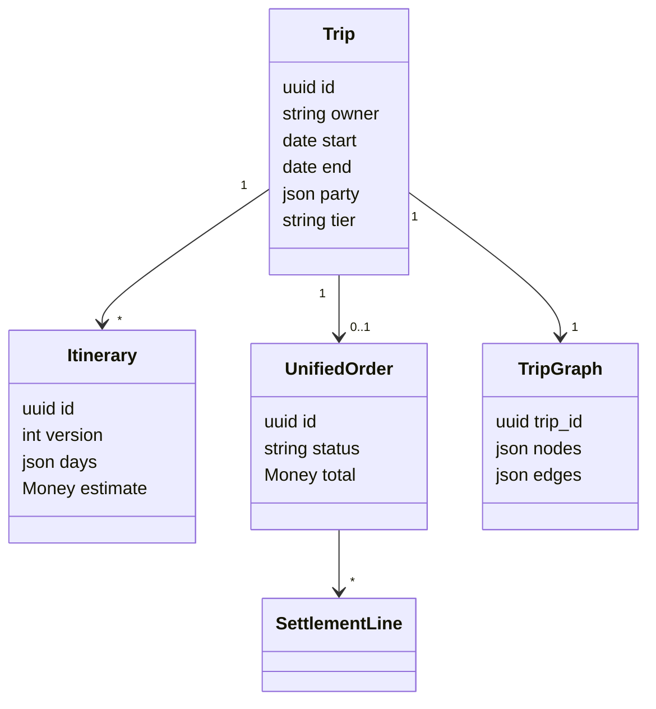
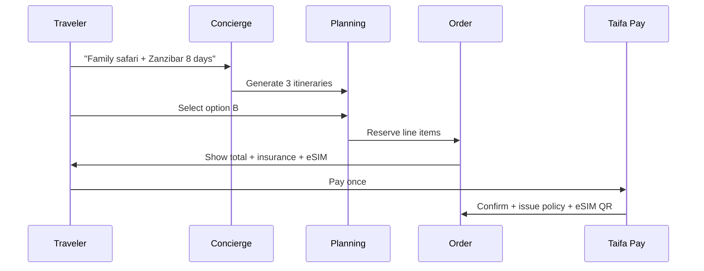
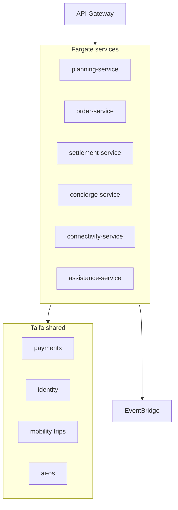
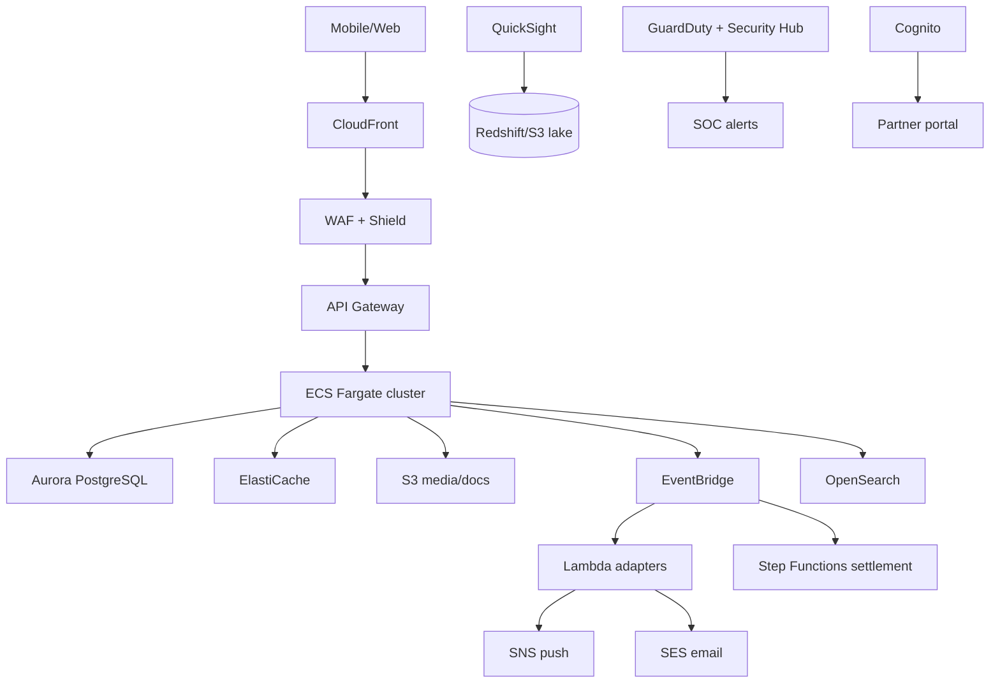
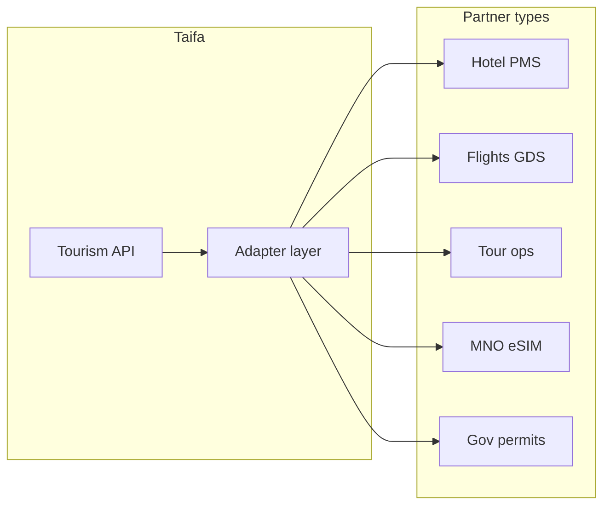
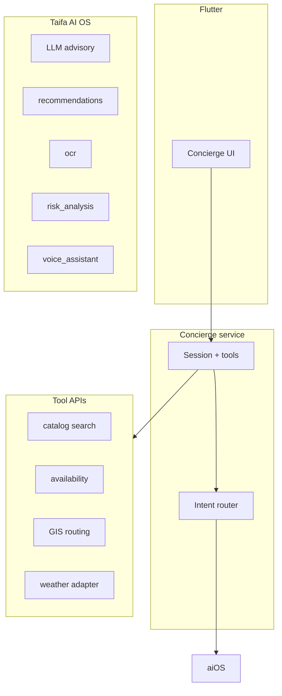
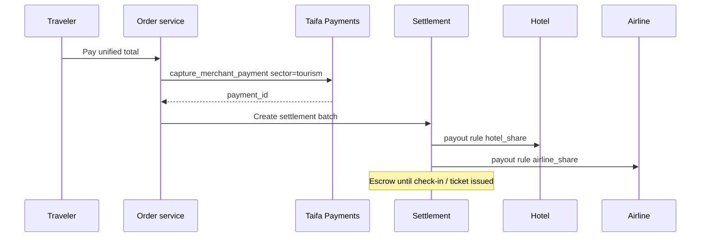
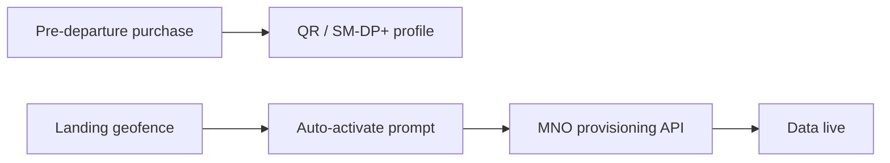
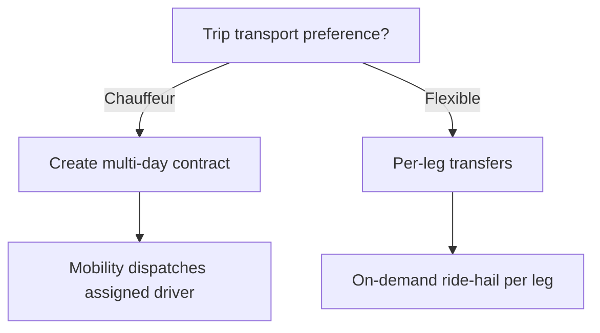

# Taifa Tourism Module — Digital Travel Operating System (DTOS)

> **Boundaries & ownership:** [CANONICAL_ENTERPRISE_ARCHITECTURE.md](CANONICAL_ENTERPRISE_ARCHITECTURE.md) wins on domains, events, APIs, and data. This blueprint is **product, UX, journeys, and target microservice topology**—when it conflicts with canonical §2–§7, defer to canonical.

**Program:** Taifa Super App · Flagship domain  
**Version:** 1.0 (architecture)  
**Status:** Enterprise blueprint  
**Companion:** [Travel Insurance (embedded)](TRAVEL_INSURANCE_BLUEPRINT.md) · [Platform layers (Presentation → Business → Shared → AWS)](ARCHITECTURE_LAYERS.md)

**North star:** Not a booking app — an **AI-powered Digital Travel Operating System** that owns the full visitor lifecycle: **dream → plan → book → pay → arrive → move → experience → protect → depart → remember**.

---

## Table of contents

1. [Product vision](#1-product-vision)  
2. [Business architecture](#2-business-architecture)  
3. [Capability model](#3-capability-model)  
4. [Domain model](#4-domain-model)  
5. [Service catalog](#5-service-catalog)  
6. [User journeys](#6-user-journeys)  
7. [Information architecture](#7-information-architecture)  
8. [UI/UX flows](#8-uiux-flows)  
9. [Wireframe descriptions](#9-wireframe-descriptions)  
10. [Microservices architecture](#10-microservices-architecture)  
11. [API specifications](#11-api-specifications)  
12. [Data model](#12-data-model)  
13. [Database design](#13-database-design)  
14. [Security architecture](#14-security-architecture)  
15. [AWS deployment architecture](#15-aws-deployment-architecture)  
16. [Partner integration architecture](#16-partner-integration-architecture)  
17. [AI architecture](#17-ai-architecture)  
18. [Payment orchestration](#18-payment-orchestration)  
19. [Travel insurance integration](#19-travel-insurance-integration)  
20. [eSIM integration](#20-esim-integration)  
21. [Mobility orchestration](#21-mobility-orchestration)  
22. [Emergency services](#22-emergency-services)  
23. [Analytics dashboards](#23-analytics-dashboards)  
24. [Monitoring](#24-monitoring)  
25. [Operational model](#25-operational-model)  
26. [MVP scope](#26-mvp-scope)  
27. [Phase-by-phase roadmap](#27-phase-by-phase-roadmap)  
28. [Technical backlog](#28-technical-backlog)  
29. [East Africa expansion](#29-east-africa-expansion)

---

## Monorepo alignment (build from what exists)

| Asset | Location | Role in DTOS |
| --- | --- | --- |
| Tourism Flutter shell | `apps/mobile/lib/features/tourism/` | Consumer DTOS UX |
| Tour/stay/flight bookings | `commerce` APIs (`tour-bookings`, `stay-bookings`, `flight-bookings`) | Transaction anchors |
| Payments / wallet | `payments` | Single checkout + split settlement |
| Mobility | `trips/`, `mobility` feature | Transfers, ride-hail, AVL |
| Travel insurance | `commerce/insurance-policies` → tourism embed | Protection layer |
| AI OS | `ecosystem/ai`, `ai_os` | Concierge, planning, OCR, risk |
| Identity | Device auth + registry/NIDA adapters | Travelers, guides, partners |
| Winga | Brokerage for guides/operators | Marketplace trust layer |
| Ecosystem modules | `GET /ecosystem/modules` | Tourism + sub-capabilities toggles |
| NFC / translate | `nfc` feature | Phrase packs → full translation roadmap |

**Rule:** Tourism **orchestrates**; it does **not** duplicate wallet, ledger, identity vault, or core mobility FSM.

---

## 1. Product vision

**Vision:** Any traveler can experience Tanzania with **one Taifa account** — inspired by AI, planned in minutes, booked once, paid once, connected on landing, moved safely, assisted 24/7, and insured by default where it matters.

**Why a DTOS, not OTA clone:**

| Booking app | Taifa DTOS |
| --- | --- |
| Siloed verticals | One **trip graph** (itinerary as source of truth) |
| User assembles apps | AI **concierge** assembles and **re-plans** |
| Pay each vendor | **Unified checkout** + automated **split settlement** |
| Arrival anxiety | **Airport mode**: eSIM, driver, hotel signal |
| Fragmented help | **Tourism Help Centre** + insurance + mobility SOS |

**Success metrics (36 months):**

- 2M+ tourism module activations (My Services)  
- 40%+ of international visitors use Taifa for ≥3 trip services  
- Median plan-to-first-booking &lt; 15 minutes (AI-assisted)  
- Airport pickup on-time rate ≥ 92%  
- eSIM activation success within 10 minutes of landing ≥ 95%  
- NPS ≥ 60 for “simplicity of trip”  

---

## 2. Business architecture



**Revenue streams:**

- Take rate on bookings (commission per category)  
- Payment orchestration fee (split payout)  
- Insurance distribution  
- eSIM resale margin  
- Premium concierge subscription (phase 3)  
- Partner SaaS (portal + API)  
- Government digitization fees (permits)  

**Governance:** Ministry of Natural Resources & Tourism alignment for permits; TCRA for telecom; TIRA for insurance; BOT/AML for payouts.

---

## 3. Capability model

| L0 | L1 capabilities | Why |
| --- | --- | --- |
| **Inspire** | Destination content, seasons, budgets, visa/health hints | Top-of-funnel; reduces bounce |
| **Plan** | AI interview, multi-itinerary generation, optimization | Core differentiator |
| **Transact** | Unified cart, checkout, policies, confirmations | One payment moment |
| **Connect** | eSIM, QR activation, roaming | Immediate utility on arrival |
| **Move** | Transfers, chauffeur, on-demand, domestic air | Uses mobility platform |
| **Experience** | Guides, permits, tickets, dining | Supply marketplace |
| **Assist** | Concierge, translation, replanning | Retention during trip |
| **Protect** | Insurance, SOS, help centre | Trust & duty of care |
| **Remember** | Expenses, reviews, rebook | LTV & data flywheel |
| **Operate** | Partner portals, analytics, fraud | Scale supply |

---

## 4. Domain model

**Aggregate roots:**

- **Trip** — traveler intent window (dates, party, budget tier, interests)  
- **Itinerary** — versioned plan (days, legs, estimates)  
- **TripGraph** — resolved bookings + status edges  
- **UnifiedOrder** — commercial wrapper for one checkout  
- **SettlementBatch** — post-payment splits to partners  
- **TravelerProfile** — preferences, accessibility, documents (vault refs)  
- **GuideEngagement** — marketplace booking + live GPS session  
- **ConnectivityOrder** — eSIM SKU + activation state  
- **AssistanceCase** — SOS / help desk ticket  



---

## 5. Service catalog

### Platform services (consume, do not rebuild)

Identity · Wallet · Payments · Notifications · Documents · GIS · Registry · Workflow · Audit · AI OS · RBAC

### Tourism domain services (own or orchestrate)

| Service | Responsibility |
| --- | --- |
| **Inspiration** | CMS + AI summaries |
| **Planning** | Itinerary CRUD, optimization |
| **Catalog** | Aggregated supply (hotels, tours, events) |
| **Booking** | Adapters to commerce bookings + external GDS/API |
| **Order** | Unified cart & checkout session |
| **Settlement** | Split rules, escrow, partner payouts |
| **Connectivity** | eSIM partner adapter |
| **Concierge** | Session state, tools, replan triggers |
| **Translation** | Speech/text/image pipeline |
| **Guide marketplace** | Winga/registry-backed listings |
| **Permits** | Government adapter (TANAPA, etc.) |
| **Insurance attach** | Quotes/bind (see insurance blueprint) |
| **Mobility orchestration** | Trip-scoped chauffeur vs on-demand |
| **Assistance** | Help centre + SOS |
| **Analytics** | Trip funnel, partner SLAs |

---

## 6. User journeys

### 6.1 Lifecycle map


### 6.2 Dreaming (pre-trip)

**Touchpoints:** Tourism home, AI chat, social share cards, “Tanzania in 7 days” templates.

**AI outputs:** Destination reels (text + image refs), seasonality, indicative budget bands (TZS/USD), visa checklist link, yellow fever / malaria advisory summary, cultural tips (dress, tipping, photography).

**Why:** Reduces planning anxiety; captures lead before competitor OTAs.

### 6.3 Planning interview

**AI collects:** party composition, budget (backpack / mid / luxury), pace, interests (safari, beach, culture, business), diet, accessibility, transport preference (chauffeur whole trip vs mix).

**Output:** 2–3 **ItineraryOption** objects with:

- Per-day narrative  
- Legs with distance/duration estimates  
- Line-item cost ranges  
- “Swap day” alternatives  

Example structure (abbreviated):

| Day | Theme | Items |
| --- | --- | --- |
| 1 | Arrival DAR | Pickup, hotel, dinner reservation |
| 2 | Serengeti | Domestic flight, lodge, safari |
| … | … | … |
| 8 | Departure | Checkout, transfer, flight |

### 6.4 Book everything → unified checkout

User selects **one itinerary version** → system materializes **bookable line items** (availability checks parallel) → **protection step** (insurance) → **connectivity step** (optional eSIM) → **single total** → Taifa Pay.

### 6.5 Arrival (airport mode)

Triggers: geofence airport + flight landed event (if integrated).

- eSIM profile install prompt  
- Driver card + live map (mobility)  
- Hotel pre-arrival message sent via partner webhook  
- Itinerary “today” surfaced on lock-screen widget (phase 2)  

### 6.6 During visit

Concierge: replan on delay, restaurant tonight, budget burn rate, translation mode, guide GPS check-in.

### 6.7 Departure & after

Expense summary, claim FNOL window, review prompts, “return trip” AI package.

---

## 7. Information architecture

```text
/tourism                          # DTOS root (module: tourism)
  /home                           # Inspire + active trip
  /plan                           # AI interview + itinerary options
  /itinerary/:id                  # Detail editor
  /book                           # Availability + cart
  /checkout                       # Insurance + eSIM + pay
  /trip/:id                       # Live trip command centre
  /trip/:id/day/:n                # Daily view
  /mobility                       # Trip transport hub (deep link to /mobility)
  /guides                         # Marketplace
  /guides/:id
  /connectivity                   # eSIM
  /insurance                      # Embedded travel insurance
  /assist                         # Concierge chat + tools
  /translate                      # Real-time translation
  /help                           # Help centre + SOS
  /wallet-trip                    # Trip expenses (read-only wallet slice)
  /history
/partner/tourism                  # Web portal (enterprise RBAC)
```

**My Services:** `tourism` module + optional flags: `tourism_esim`, `tourism_concierge_pro`.

---

## 8. UI/UX flows

### Flow A — First-time international visitor



### Flow B — Chauffeur vs on-demand

- **Trip settings:** “Dedicated chauffeur entire trip” → creates `MobilityTripContract`  
- Else: per-leg “book transfer” opens mobility with `trip_id` context  

### Flow C — Delay replan

Flight delay event → push → AI proposes delta itinerary → user accepts → partial refund/charge via settlement engine.

---

## 9. Wireframe descriptions

| Screen | Key elements | Rationale |
| --- | --- | --- |
| **Tourism Home** | Active trip card, “Plan new trip”, inspire carousel, connectivity status chip | Single entry |
| **AI Plan** | Chat + structured chips (budget, party, dates); side panel itinerary preview | Low typing friction |
| **Itinerary compare** | 3 columns mobile swipe; cost band; highlights | Decision support |
| **Unified checkout** | Sections: Travel · Protection · Connectivity · Total; wallet rail selector | One pay moment |
| **Trip command centre** | Timeline, SOS, concierge FAB, today’s map | In-destination hub |
| **Translation** | Mic hold, camera for menu/sign, conversation split view | Tourist-local bridge |
| **Guide live** | Map, guide photo, registry badge, “I’m safe” check-in | Safety + trust |
| **Help centre** | SOS (hold), hospitals, embassy, insurance claim shortcut | Crisis UX |

**Design system:** Taifa tokens (`taifa_colors`, `taifa_typography`); Kiswahili + English; WCAG 2.1 AA.

---

## 10. Microservices architecture

**Phase 1 (monolith-friendly):** Django app `tourism` inside `apps/backend` orchestrating `commerce` bookings.

**Phase 2+ (extract under load):**



| Service | Events published |
| --- | --- |
| planning | `itinerary.finalized` |
| order | `checkout.completed` |
| settlement | `payout.scheduled`, `payout.completed` |
| connectivity | `esim.provisioned` |
| assistance | `sos.opened` |

---

## 11. API specifications

**Base:** `/api/v1/tourism/`  
**Auth:** `IsDevice` (traveler); enterprise roles for partner routes.

| Method | Path | Description |
| --- | --- | --- |
| GET | `inspiration/feed` | Curated + personalized |
| POST | `trips` | Create trip shell |
| POST | `trips/{id}/plan` | Start AI planning session |
| GET | `trips/{id}/itineraries` | List generated options |
| PUT | `trips/{id}/itineraries/{vid}/select` | Lock choice |
| POST | `trips/{id}/cart/build` | Availability + pricing |
| POST | `trips/{id}/checkout` | Create unified order |
| POST | `trips/{id}/checkout/pay` | Idempotent pay |
| GET | `trips/{id}/timeline` | Live trip graph |
| POST | `trips/{id}/replan` | AI delta |
| GET | `guides` | Marketplace search |
| POST | `guides/{id}/book` | Guide booking |
| POST | `connectivity/esim/quote` | Plans |
| POST | `connectivity/esim/order` | Purchase |
| GET | `connectivity/esim/{id}/qr` | Activation payload |
| POST | `assist/sos` | Emergency |
| GET | `assist/nearby` | Hospitals, police, embassy |
| POST | `translate` | Text/voice/image |
| GET | `partners/availability` | B2B bulk |

**Webhooks (outbound to partners):** `booking.confirmed`, `traveler.arriving`, `payout.sent`.

OpenAPI: extend `apps/backend/openapi.yaml`; CI `spectacular --fail-on-warn`.

---

## 12. Data model

**Key entities:** `Trip`, `ItineraryVersion`, `ItineraryDay`, `ItineraryLeg`, `CatalogItem`, `CartLine`, `UnifiedOrder`, `OrderLine`, `SettlementLine`, `PartnerAccount`, `GuideProfile`, `GuideBooking`, `ConnectivityOrder`, `ConciergeSession`, `TranslationRequest`, `AssistanceCase`, `TripExpense` (refs to wallet txns).

**Linkage to commerce today:**

- `OrderLine.external_ref` → `tour-bookings/{uuid}`, `stay-bookings/{uuid}`, `flight-bookings/{uuid}`

---

## 13. Database design

- **Primary store:** PostgreSQL (Aurora in AWS)  
- **Cache:** Redis — session plans, quote TTL, geofence state  
- **Documents:** S3 — itineraries PDF, visas, insurance certs  
- **Search:** OpenSearch — guides, experiences, logs  
- **Analytics:** Warehouse tables `tourism_fact_booking`, `tourism_fact_trip`  

**Indexing:** `(owner, trip_status)`, `(partner_id, settlement_status)`, GIN on `itinerary_days` JSONB for admin queries.

---

## 14. Security architecture

- **Zero Trust:** Every service call authenticated; partner mTLS optional  
- **RBAC:** `tourism-traveler`, `tourism-guide`, `tourism-partner-admin`, `tourism-ops`  
- **MFA:** Partners & ops mandatory  
- **Encryption:** AES-256 at rest (KMS); TLS 1.3 in transit  
- **PII:** Passport/visa in documents vault; itinerary shows masked refs  
- **PCI:** Tokenized cards only via payment gateways  
- **Audit:** Append-only `TourismAuditEvent` mirroring transit audit pattern  
- **Fraud:** Velocity on checkout, device graph, AI anomaly on replan refunds  

---

## 15. AWS deployment architecture



**Scale:** Horizontal ECS autoscaling on CPU + checkout queue depth; read replicas for inspiration feed; CloudFront for static destination content.

**DR:** `af-south-1` primary; DR region warm standby; RPO 15m / RTO 4h for checkout path.

---

## 16. Partner integration architecture



**Patterns:**

- **Pull catalog** (scheduled) + **real-time availability** (sync API)  
- **Idempotent booking** with partner reference  
- **Webhook ACK** with signed payloads (ecosystem webhook model)  
- **Sandbox** credentials per partner in Secrets Manager  

**Portal features:** Inventory, pricing, blackout dates, booking inbox, payout statements, SLA dashboard.

---

## 17. AI architecture



**Tool-calling (concierge):** `search_experiences`, `get_weather`, `estimate_route`, `hold_inventory`, `suggest_restaurant`, `replan_day`, `translate_phrase`.

**Guardrails:** Prices shown are **quotes** until checkout; government/visa info labeled “verify official source”; no autonomous payments without user confirm.

**Offline:** Cached itinerary + phrase pack; queue replan requests when online.

---

## 18. Payment orchestration

**Goal:** Traveler pays **once**; platform **splits** to partners automatically.



**Mechanisms:**

- **Merchant of record** model (Taifa or licensed partner — legal decision)  
- **Split rules** per `OrderLine` (`percent` or `fixed_minor`)  
- **Escrow** until fulfillment milestone (check-in, permit issued)  
- **Rails:** M-Pesa, Airtel, Mixx, HaloPesa, cards, wallet, bank, corporate billing  

**Why:** Removes tourist friction; partners get predictable settlement files.

**Implementation path:** Extend `capture_merchant_payment` metadata with `settlement_plan_id`; Celery/Step Functions execute splits.

---

## 19. Travel insurance integration

Embedded in every checkout path — see **[TRAVEL_INSURANCE_BLUEPRINT.md](TRAVEL_INSURANCE_BLUEPRINT.md)**.

**DTOS-specific:**

- AI recommends product from **trip graph** (activities, destinations, duration)  
- Policy `trip_id` foreign key  
- Airport mode surfaces policy + SOS  

---

## 20. eSIM integration



**UX:** Choose plan (GB / days) → pay with trip checkout or standalone → email + in-app QR → on arrival, one-tap install (iOS/Android eSIM APIs).

**Partner:** Tanzanian MNO adapter (TCRA-compliant); wholesale API; fallback manual USSD instructions.

**Taifa value:** Immediate connectivity → higher concierge engagement and safety.

---

## 21. Mobility orchestration

**Reuse** `trips` mobility stack — do not fork dispatch.

| Mode | Integration |
| --- | --- |
| Airport pickup | Scheduled ride linked to `trip_id` + flight ETA |
| Ride-hailing | Deep link with prefilled destination from itinerary |
| Chauffeur trip | Multi-day `MobilityTripContract` |
| Car rental | Commerce / partner adapter |
| Boat / ferry | Intercity / logistics APIs |
| Domestic flights | `flight-bookings` + replan hooks |

**User choice:** Dedicated chauffeur **or** on-demand per leg — stored in `Trip.transport_mode`.

---

## 22. Emergency services

**Tourism Help Centre** (single entry under `/tourism/help`):

- 24/7 chat escalation  
- SOS (hold to confirm) → `AssistanceCase` + mobility `SafetyIncident` pattern  
- Geo layers: hospitals, police, pharmacies, embassies  
- Insurance FNOL shortcut  
- Disaster push (geotargeted)  
- Family notify via notifications  

---

## 23. Analytics dashboards

| Audience | Metrics |
| --- | --- |
| **Travelers** | Spend by category, days remaining, carbon estimate (phase 3) |
| **Taifa exec** | GMV, attach rates (insurance, eSIM), funnel |
| **Partners** | Occupancy, conversion, payout lag |
| **Government** | Aggregated visitation, permit revenue (privacy-safe) |
| **Ops** | SOS volume, SLA, replan rate |

**Stack:** QuickSight + `tourism` analytics API; mirror key KPIs in `city_ops` / `national_ops` when tourism ops enabled.

---

## 24. Monitoring

- **SLOs:** API 99.9%; checkout p95 &lt; 3s; concierge first token &lt; 2s  
- **CloudWatch** dashboards; **X-Ray** on checkout saga  
- **Alerts:** Payment capture failure, settlement stuck, eSIM provision failure, SOS queue &gt; 60s unassigned  
- **Logging:** OpenSearch with PII scrubbing  

---

## 25. Operational model

| Function | Team | Tools |
| --- | --- | --- |
| L1 traveler support | Tourism Help Centre | Assist desk + AI copilot |
| L2 partner disputes | Partner ops | Settlement console |
| L3 engineering | Platform | Runbooks, chaos days |
| Compliance | Legal + risk | TIRA/TCRA reporting exports |

**Incident severities:** SEV1 SOS/ payment down; SEV2 booking adapter outage; SEV3 content stale.

---

## 26. MVP scope (90 days)

**In scope:**

- Tourism DTOS shell: Home, Plan (AI interview v1), single itinerary select  
- Book: **tours + stays** (existing commerce APIs)  
- Unified checkout (tours + stays + insurance basic attach)  
- Trip timeline v1 (static)  
- Concierge chat (AI OS, tool-less FAQ + handoff)  
- Help centre + SOS (reuse mobility safety backend)  
- Partner: manual onboarding (ops) — no self-serve portal  

**Out of scope MVP:**

- Full GDS flights  
- Automated settlement splits (manual partner settlement ok)  
- eSIM automation (link-out or waitlist)  
- Guide GPS live tracking  
- Chauffeur multi-day contracts  

---

## 27. Phase-by-phase roadmap

| Phase | Theme | Deliverables |
| --- | --- | --- |
| **1** | DTOS foundation | Trip model, plan UI, tour/stay unified checkout, insurance attach |
| **2** | Arrive & move | Airport pickup integration, mobility deep links, eSIM MVP |
| **3** | Supply scale | Partner portal, flights, permits adapter, settlement automation |
| **4** | Intelligence | Tool-calling concierge, replan on delays, translation v1 |
| **5** | Marketplace | Verified guides, GPS sessions, Winga commissions |
| **6** | Regional | Kenya/Uganda catalog adapters, EAC payments |

---

## 28. Technical backlog (epics)

1. **TAIFA-TOUR-001** — `Trip` / `ItineraryVersion` models + migrations  
2. **TAIFA-TOUR-002** — Planning API + AI interview prompts (sw/en)  
3. **TAIFA-TOUR-003** — Cart builder over `tour-bookings` / `stay-bookings`  
4. **TAIFA-TOUR-004** — Unified checkout + payment metadata  
5. **TAIFA-TOUR-005** — Flutter DTOS navigation refactor (`TourismPhase` → trip-centric)  
6. **TAIFA-TOUR-006** — Insurance step integration  
7. **TAIFA-TOUR-007** — Assistance / SOS wiring  
8. **TAIFA-TOUR-008** — Settlement engine design doc → implement  
9. **TAIFA-TOUR-009** — eSIM partner adapter spike  
10. **TAIFA-TOUR-010** — OpenAPI + contract tests  
11. **TAIFA-TOUR-011** — Partner webhook HMAC + replay protection  
12. **TAIFA-TOUR-012** — Analytics events schema  

---

## 29. East Africa expansion

1. **Regulatory** — per-country tourism and telecom licenses for eSIM resale  
2. **Catalog** — Kenya safari, gorilla permits (UG), RW MICE  
3. **Payments** — local rails via existing gateway adapters  
4. **Identity** — East Africa ID for guides  
5. **Super App** — `tourism` module per country with localized inspire feed  
6. **Continental ops** — dashboard slice in existing `continental_ops` feature  

---

## Appendix — Decision: Chauffeur vs on-demand



---

## Appendix — Offline strategy

| Feature | Offline behavior |
| --- | --- |
| Itinerary | Full read cache |
| Policy / SOS | Last synced policy + emergency numbers |
| Translation | Downloaded phrase pack |
| Replan | Queue intent; sync when online |
| Payments | Not offline — require connectivity |

---

**Document owner:** Taifa Tourism & Platform guild  
**Related:** `docs/DIGITAL_ECOSYSTEM.md`, `docs/ECOSYSTEM_ARCHITECTURE.md`, `docs/tourism/TRAVEL_INSURANCE_BLUEPRINT.md`
