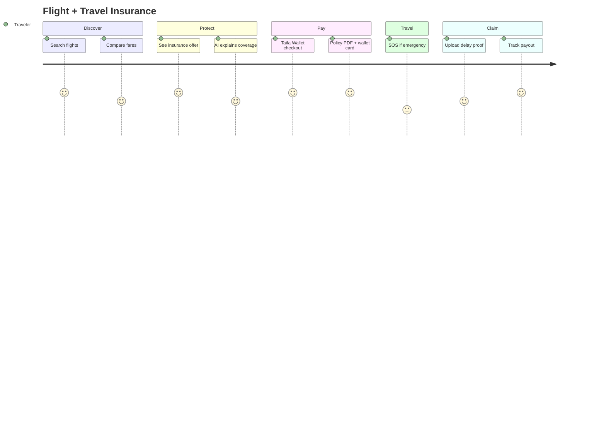
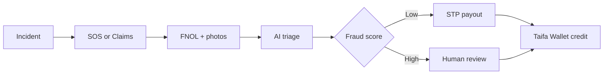
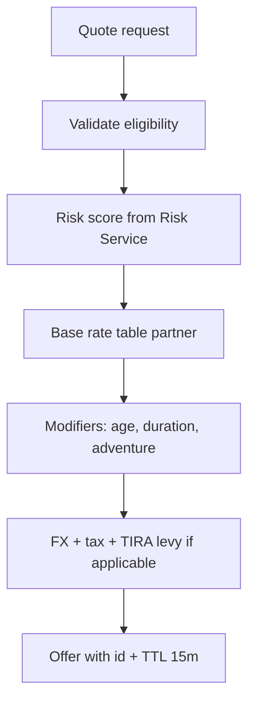
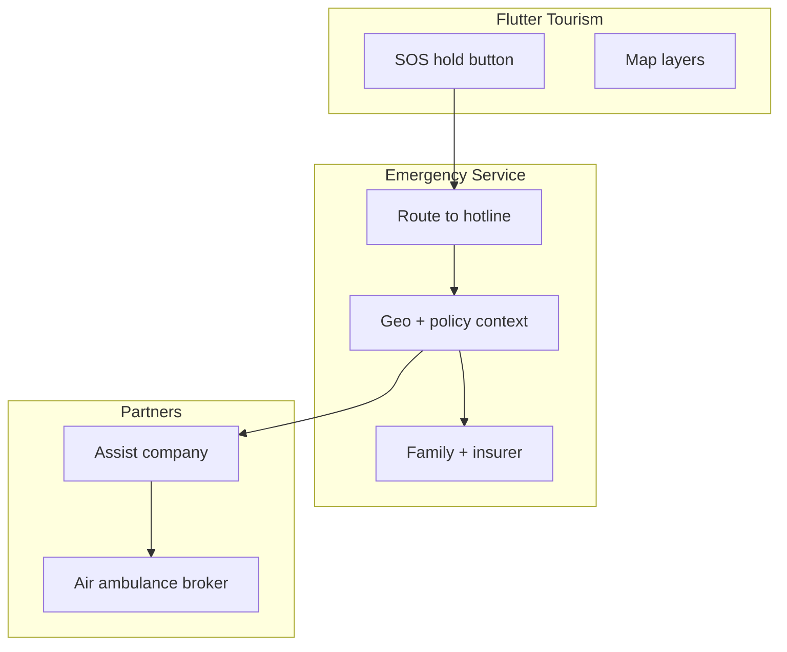
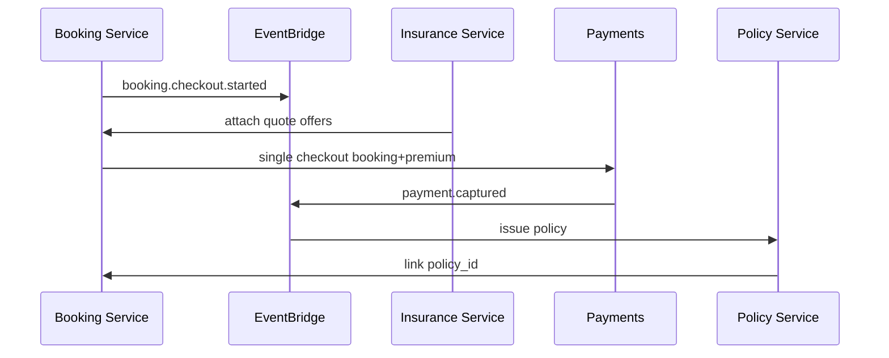
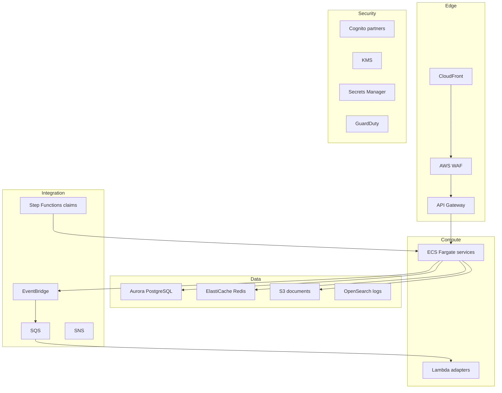
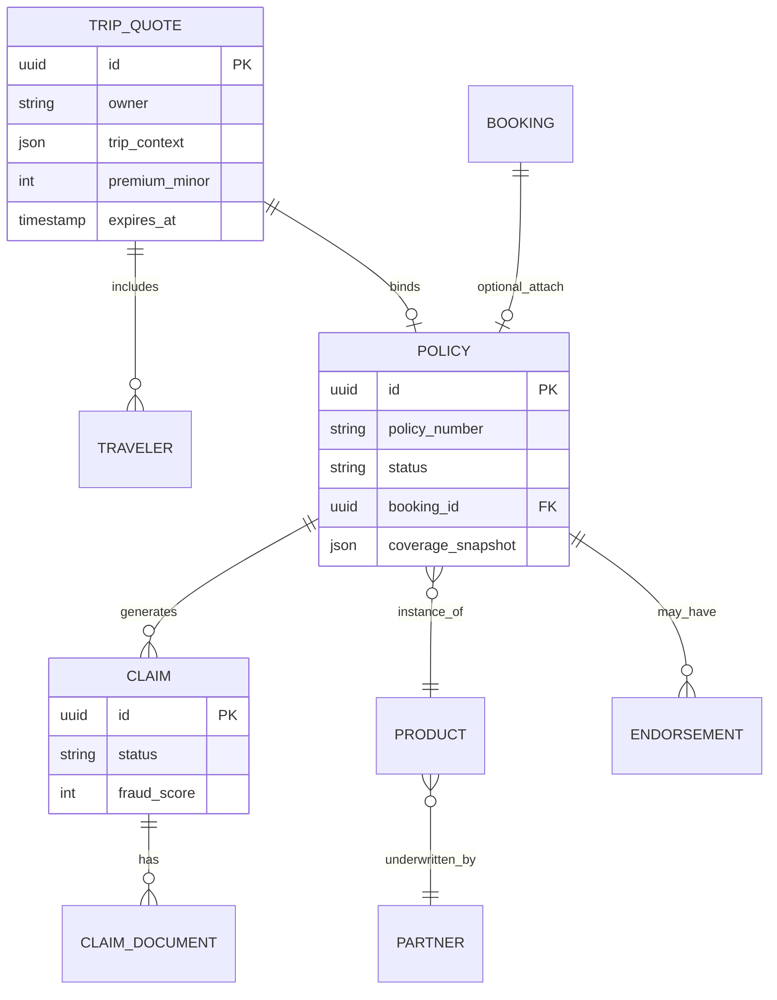
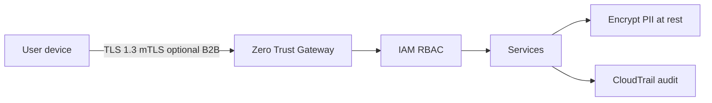
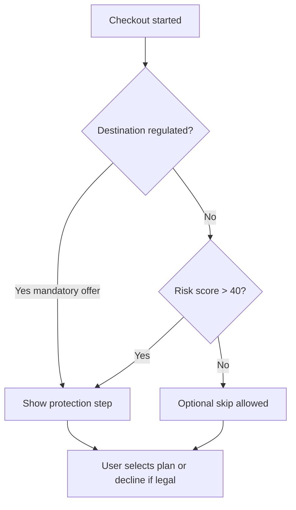

# Taifa Travel Insurance — Enterprise Architecture Blueprint

**Program:** Taifa Super App · Tourism domain (embedded capability)  
**Version:** 1.0 (design)  
**Status:** Architecture & product specification  
**Audience:** Product, engineering, insurers, regulators, AWS/platform teams  

**Principle:** Travel Insurance is **not** a standalone app. It is a **bounded capability** inside the Tourism module, orchestrating shared Taifa platform services (identity, payments, wallet, documents, AI, notifications, workflow, audit).

---

## Alignment with this monorepo (today → target)

| Layer | Today (repo) | Target (this blueprint) |
| --- | --- | --- |
| Tourism UX | `apps/mobile/lib/features/tourism/` | Same shell; insurance as sub-journeys |
| Standalone insurance UI | `features/insurance/` (redirect/merge into tourism) | Deprecate top-level route; deep-link from tourism only |
| Policies API | `POST/GET /api/v1/commerce/insurance-policies` | Evolve to `tourism/travel-insurance/*` with booking linkage |
| Payments | Taifa Payments / Wallet (`capture_merchant_payment`) | Same — **no insurance ledger** |
| Identity | Device auth + NIDA hooks via registry | OIDC for partners; principal = device owner |
| AI | `ecosystem/ai/{capability}/invoke`, `ai_os` | Risk, fraud, OCR, recommendations |
| Ecosystem | `SuperAppModule` `tourism` + My Services toggles | `travel_insurance` as tourism sub-capability flag |

---

## 1. Product vision

**Vision:** Make Taifa the default place Tanzanians and visitors **book travel and leave protected** — one checkout, one wallet, one digital policy, one SOS line — scaled to East Africa.

**Why embedded in Tourism:** Insurance attach rate is highest at **booking intent** (flights, hotels, tours, ferries). A separate app fragments trust, drops conversion, and duplicates KYC. Embedding insurance in Tourism keeps users in a single mental model: *discover → book → protect → travel → claim*.

**North-star metrics:**

- Attach rate ≥ 35% on international bookings within 24 months of launch  
- Median policy issuance &lt; 90 seconds after payment  
- Claim FNOL (first notice of loss) &lt; 3 minutes on mobile  
- NPS ≥ 55 for emergency assistance  
- Fraud loss ratio &lt; 2% of premiums (AI-assisted)  

---

## 2. Business objectives

| Objective | KPI | Why |
| --- | --- | --- |
| Revenue | Premium GMV, commission per partner | Sustainable insurer + Taifa platform economics |
| Inclusion | Domestic + pilgrimage products | Tanzania-specific travel patterns |
| Trust | TIRA-aligned disclosures, audit trail | Regulatory license & partner onboarding |
| Efficiency | Straight-through processing (STP) claims | Lower loss adjustment expense |
| Scale | Multi-tenant partner portal | Many underwriters, one consumer UX |
| Regional | EAC passporting of products | Kenya, Uganda, Rwanda expansion |

---

## 3. User personas

| Persona | Needs | Insurance moment |
| --- | --- | --- |
| **Leisure traveler (domestic)** | Safari, Zanzibar, family trips | Optional add-on at tour/hotel checkout |
| **International tourist** | Visa, medical cover, evacuation | Strong default recommendation at flight booking |
| **Business traveler** | Receipts, corporate billing, delay cover | Corporate policy + per-trip top-up |
| **Student** | Long-stay, study abroad | Student pack at education-linked travel |
| **Pilgrim (Hajj/Umrah)** | Group, health, repatriation | Mandatory-style bundle with pilgrimage operators |
| **Medical tourist** | Hospital network, pre-auth | Medical travel product + provider directory |
| **Group organizer** | One payment, many certificates | Group policy master + individual certs |
| **Tour operator** | White-label attach, commission | Partner portal + API |
| **Claims adjuster** | Evidence, fraud signals | Admin portal + AI triage |
| **Regulator / TIRA viewer** | Aggregated reporting | BI dashboard (anonymized) |

---

## 4. User journey maps (summary)

### 4.1 Flight booking + insurance



### 4.2 Post-incident claim



---

## 5. Customer experience flow

**Design rule:** Never leave Tourism module chrome (Taifa theme, back stack, wallet chip).

1. **Home** — Tourism hub: Flights, Stays, Tours, Transport, **My cover**  
2. **Booking funnel** — Product detail → travelers → **Protection step** (skippable only where regulation allows)  
3. **Protection step** — Compare plans (Basic / Standard / Premium / contextual packs)  
4. **Checkout** — Single line items: booking + premium + add-ons; idempotent payment  
5. **Confirmation** — Digital policy, QR, add to Apple/Google Wallet (phase 2)  
6. **Trip** — Countdown, coverage summary, SOS, embassy map  
7. **Post-trip** — Claim entry, feedback, renew for return journey  

---

## 6. UI/UX architecture

**Information architecture (Tourism root):**

```text
/tourism
  /home
  /flights/*          → insurance step in checkout
  /stays/*            → insurance step
  /experiences/*      → existing tour flow + insurance
  /transport          → bus, ferry, car rental tabs
  /insurance          → hub (not separate app): plans, policies, claims
    /quote
    /checkout
    /policy/:id
    /claims
    /claims/:id
    /emergency
  /bookings
```

**Wireframe descriptions (key screens):**

| Screen | Layout | Why |
| --- | --- | --- |
| **Protection step** | Hero “Travel with confidence”; 3 plan cards; expandable coverage table; TIRA disclaimer footer | Conversion + compliance |
| **Risk banner** | AI chip: “Elevated health advisory — consider Premium” | Contextual upsell, not dark pattern |
| **Policy wallet card** | Green status, policy #, dates, SOS CTA | Offline airport access |
| **Claim FNOL** | Stepper: type → evidence → review → submit | Reduces abandonment |
| **Emergency** | Full-screen SOS + hold-to-confirm; map layers | Stress-case UX |

**Accessibility:** WCAG 2.1 AA, Kiswahili + English, large text, voice-over labels on SOS.

---

## 7. Navigation structure

- **Primary:** Tourism tab / route from Home when `tourism` module enabled  
- **Secondary:** Deep links from flights/stays/express mobility bookings with `?attach=travel_insurance`  
- **My Services:** Sub-toggle `travel_insurance` under tourism (optional; default on when tourism on)  
- **No** standalone `/insurance` in bottom nav — redirect to `/tourism/insurance`  

---

## 8. Feature breakdown

| Epic | Features | Platform reuse |
| --- | --- | --- |
| **Quote & bind** | Multi-traveler, trip dates, destination risk | Pricing + Risk services |
| **Embedded attach** | Hooks in all booking checkouts | Booking service events |
| **Policy lifecycle** | Issue, endorse, cancel, renew | Policy service + documents |
| **Claims** | FNOL, docs, status, payout | Workflow + payments |
| **Emergency** | SOS, geo, hotline routing | Mobility safety patterns + GIS |
| **Partner** | Product config, commissions | Enterprise RBAC |
| **AI** | Risk, recommend, fraud, OCR | AI OS |
| **Reporting** | Premium, loss ratio, SLA | Analytics + QuickSight |

---

## 9. Insurance products

| Product | Segment | Core coverage (indicative) | Default attach context |
| --- | --- | --- | --- |
| **Basic** | Budget domestic | Accident, local medical limit, baggage | Bus, short tour |
| **Standard** | Leisure | Medical, delay, baggage, personal liability | Hotel, tour package |
| **Premium** | International | Higher limits, evacuation, cancel for any reason (where licensed) | Flights |
| **Family** | Family travel | Multi-insured, children | Package holidays |
| **Student** | Study travel | Long stay medical, liability | Education corridor |
| **Corporate** | Business | Delay, laptop, liability | Enterprise billing |
| **VIP** | High net worth | Concierge, higher limits | Premium checkout |
| **Pilgrimage** | Hajj/Umrah | Group health, repatriation, trip cancel | Pilgrimage operator |
| **Medical travel** | Medical tourism | Pre-auth network, companion | Health module handoff |
| **Adventure** | Safari/adventure | Activity riders (diving, trekking) | Safari tours |

**Per product schema:** `coverage[]`, `benefits[]`, `exclusions[]`, `premium_rules`, `eligibility_rules`, `claims_playbook`, `emergency_tier`, `addons[]`.

---

## 10. Pricing engine

**Inputs:** destination (ISO), trip duration, traveler ages, trip cost, product code, channel, partner markup, FX (TZS/USD).

**Logic:**



**Why:** Actuarial tables stay **partner-owned**; Taifa runs **orchestration + audit**. Rates versioned (`rate_card_version`) for disputes.

**Storage:** `rate_cards`, `quote_snapshots` (immutable at bind time).

---

## 11. Risk assessment engine

**Signals:**

- Destination: CDC/WHO feeds, MoH Tanzania advisories (adapter)  
- Weather: forecast along route  
- Political: curated risk index (commercial data provider)  
- Seasonal disease: dengue/malaria zones  
- Booking: carrier on-time stats, route history  

**Output:** `risk_score` 0–100, `recommended_product`, `required_disclosures[]`.

**Integration:** Synchronous for quote (&lt; 300ms p95 with cache); async refresh on EventBridge when advisories change → push notification to active policies if material.

---

## 12. AI recommendation engine

| Capability | Input | Output | Authority |
| --- | --- | --- | --- |
| **Plan recommend** | Trip profile + risk | Ranked plans | Advisory only |
| **Upsell copy** | Locale sw/en | Explain benefit | UI |
| **Claim validate** | Photos + policy | Fraud + completeness score | Adjuster assist |
| **Support bot** | Chat | FNOL guidance | AI OS `voice_assistant` / custom |
| **OCR** | Passport, boarding pass | Structured fields | Documents service |

**Guardrails:** No auto-deny claims without human review above threshold; log `decision_id` per AI OS pattern.

---

## 13. Emergency assistance platform



**Features:** Nearby hospitals/pharmacies/police (GIS), embassies by nationality, translation phrase pack (reuse NFC/translate assets), emergency cash advance (wallet credit line — policy permitting).

---

## 14. Claim management system

**States:** `draft` → `submitted` → `under_review` → `approved` / `rejected` → `paid` → `closed`

**Evidence types:** photo, medical_report, police_report, delay_certificate, baggage_pir, passport, visa, hospital_bill

**Why digital-first:** Reduces adjuster travel cost; aligns with Tanzania mobile-first population.

**Payout:** `capture_merchant_payment` reverse flow / wallet credit with idempotency key `claim-{id}`.

---

## 15. Fraud detection engine

**Rules + ML:**

- Duplicate receipt hash  
- EXIF/geo mismatch vs claimed location  
- Velocity: multiple claims same device  
- Network: linked devices / beneficiaries  
- Model: gradient boosted tabular on historical claims (phase 2)  

**Actions:** Score 0–1 → auto-approve band, manual queue, SAR flag to compliance.

---

## 16. Insurance partner portal

**Users:** Underwriter product managers, actuaries, assist companies.

**Functions:** Rate cards, product CRUD, commission rules, claim queue, SLA dashboard, API keys (open platform pattern).

**Auth:** Enterprise RBAC roles `insurance-partner-admin`, `insurance-adjuster`.

---

## 17. Admin portal (Taifa)

**Functions:** Partner onboarding, catalog seed, feature flags, dispute override, regulatory exports, incident runbooks.

**Surface:** Extend `city_ops` / national ops pattern or dedicated `/tourism-admin` web console.

---

## 18. Customer portal

**In-app only** (no separate web required v1): policies, claims, emergency, documents vault.

---

## 19. Notification system

| Event | Channel | Template |
| --- | --- | --- |
| Policy issued | Push + email | PDF link |
| Trip reminder | Push | Coverage summary |
| Advisory | Push | Risk change |
| Claim update | Push + SMS fallback | Status |
| Payout | Push + wallet | Amount |

Reuse `integrations.notifications` + device push tokens.

---

## 20. Reporting & analytics

- Premium written, earned, unearned  
- Loss ratio by product/partner  
- Attach rate by booking type  
- FNOL-to-pay SLA  
- SOS volume by region  

---

## 21. Business intelligence dashboard

**QuickSight** (or Metabase on-prem mirror) fed from **analytics service** warehouse:

- Executive: GMV, active policies, claims ratio  
- Government: aggregated tourism protection stats (privacy-preserving)  
- Partner: their book only (tenant isolation)  

---

## 22. API architecture

**Style:** REST v1 authoritative; events async; OpenAPI in `apps/backend/openapi.yaml`.

**Proposed namespace:** `/api/v1/tourism/travel-insurance/`

| Method | Path | Description |
| --- | --- | --- |
| GET | `products` | Catalog by trip context |
| POST | `quotes` | Create quote (TTL) |
| POST | `policies` | Bind after payment token |
| GET | `policies/mine` | Wallet of policies |
| GET | `policies/{id}/certificate` | PDF/JSON |
| POST | `claims` | FNOL |
| POST | `claims/{id}/documents` | Upload |
| GET | `claims/{id}` | Status |
| POST | `emergency/sos` | Open incident |
| GET | `emergency/nearby` | POI by type |
| POST | `webhooks/partner` | Insurer callbacks |

**Booking integration (internal):**



**Migration:** Wrap existing `commerce/insurance-policies` → new service; deprecate with 6-month sunset.

---

## 23. AWS cloud architecture (target production)



**Why AWS:** Matches enterprise insurer expectations; Tanzania region strategy via `af-south-1` + CloudFront edge; DR cross-region.

**Monorepo path:** Django remains **system of record** in phase 1; extract hot paths (pricing, fraud) to Fargate when load dictates.

---

## 24. Database architecture (logical ERD)



**Partitioning:** Policies by `issued_at` month; claims by `partner_id` for tenant queries.

---

## 25. Microservices architecture

| Service | Responsibility | Owns data |
| --- | --- | --- |
| **Booking** | Flights, hotels, tours, transport | bookings |
| **Insurance** | Orchestration, attach offers | quotes |
| **Policy** | Issue, cancel, certificate | policies |
| **Pricing** | Rate cards, quote math | rate_cards |
| **Risk** | Scores, advisories | risk_snapshots |
| **Claims** | FNOL, workflow | claims |
| **Emergency** | SOS incidents | incidents |
| **AI** | Models, OCR (facade to AI OS) | features |
| **Notification** | Templates, delivery | outbox |
| **Partner** | Tenant config | partners |
| **Analytics** | ETL, aggregates | warehouse |
| **Payment** | **Taifa Payments** (shared) | ledger |
| **Identity** | **Taifa Identity** (shared) | principals |
| **User** | Profile, travelers | travelers |

**Communication:** Sync REST for checkout; async events for issue/claim; **no** distributed transactions — saga via Step Functions.

---

## 26. Security architecture



- **PCI DSS:** Card data only via tokenized gateways (Selcom/M-Pesa/etc.) — never store PAN.  
- **ISO 27001:** Control mapping in ISMS; Taifa platform gates (`TAIFA_ALLOW_STUB_ADAPTERS=false` prod).  
- **OAuth 2.0 / OIDC:** Partner portal via Cognito; mobile stays device auth.  
- **JWT:** Short-lived service tokens; `policy_certificate` signed QR like transit tickets pattern.  
- **MFA:** Partners and admins mandatory; step-up for claim approval.  

---

## 27. Compliance architecture

| Requirement | Implementation |
| --- | --- |
| **TIRA** (Tanzania) | Licensed partner products; disclosure screens; regulatory reporting export |
| **Data protection** | Consent for health data; retention schedules |
| **AML** | Large claim payouts → enterprise rules engine |
| **Cross-border** | Data residency flags per tenant (EAC expansion) |

---

## 28. Disaster recovery plan

- **RPO:** 15 minutes (Aurora continuous backup)  
- **RTO:** 4 hours critical path (API + issue policy)  
- **Runbook:** Failover DNS Route53; read-only mode banner in app  
- **Game days:** Quarterly restore test  

---

## 29. Backup strategy

- Aurora automated backups + cross-region copy  
- S3 versioning for claim documents  
- AWS Backup centralized policy  
- Config snapshots for IaC (Terraform in `infra/` when introduced)  

---

## 30. Monitoring & logging

- **CloudWatch** metrics: quote latency, bind success, SOS rate  
- **OpenSearch** centralized logs; PII scrubbing  
- **X-Ray** tracing on checkout saga  
- **SLOs:** 99.9% API availability; p95 quote &lt; 500ms  
- **Alerts:** PagerDuty on payment bind failures, SOS queue depth  

---

## 31. AI integration

**Taifa AI OS** (`POST /api/v1/ecosystem/ai/{capability}/invoke`):

- `recommendations` — plan ranking  
- `fraud_detection` — claim signals  
- `ocr` — documents  
- `risk_analysis` — trip advisory  
- `voice_assistant` — Kiswahili emergency guidance  

**Human-in-the-loop** for claim denial and premium override.

---

## 32. Machine learning opportunities

| Phase | Model | Data |
| --- | --- | --- |
| 1 | Rules + heuristics | Partner tables |
| 2 | Flight delay classifier | Historical delays |
| 3 | Claim fraud GBDT | Labeled claims |
| 4 | Dynamic pricing assist | Quote conversion |
| 5 | NLP FNOL | Chat transcripts |

---

## 33. Future roadmap

| Quarter | Milestone |
| --- | --- |
| Q1 | Embedded attach on tour + hotel; Basic/Standard/Premium |
| Q2 | Flights + ferry; claims FNOL; SOS v1 |
| Q3 | Partner portal; pilgrimage pack; corporate billing |
| Q4 | Kenya pilot; air ambulance partner; ML fraud v1 |
| Y2 | EAC harmonization; embedded reinsurance reporting |

---

## 34. East African expansion strategy

1. **Product passporting** — core benefits matrix per country regulator  
2. **Partner** — local admitted insurer per jurisdiction  
3. **Payments** — M-Pesa KE, MTN MoMo UG adapters (existing gateway pattern)  
4. **Identity** — East Africa ID adapters via registry  
5. **Ops** — `continental_ops` dashboard slice for travel insurance KPIs  

---

## 35. Technical documentation (implementation phases)

### Phase A — Tourism embed (MVP)

1. Add `TravelInsuranceStep` widget to `tourism` checkout + flights/stays stubs  
2. Extend `InsurancePolicy` model with `booking_id`, `trip_snapshot`, `product_code`  
3. API `tourism/travel-insurance/quotes` + bind on payment webhook  
4. Policy certificate PDF via documents service  
5. Redirect `/insurance` → `/tourism/insurance`  

### Phase B — Claims & emergency

1. Claim models + Flutter stepper  
2. SOS reuse `SafetyIncident` / mobility safety patterns  
3. Step Functions workflow for adjusters  

### Phase C — Partner & scale

1. Partner portal (enterprise roles)  
2. Extract pricing/risk to Fargate if needed  
3. QuickSight dashboards  

### Decision tree — offer insurance at checkout?



### Deployment diagram (phase 1 monolith-friendly)

```text
[Flutter Tourism] --> [Django DRF commerce + tourism_insurance app]
                         --> [PostgreSQL]
                         --> [Redis cache]
                         --> [S3 docs]
                         --> [Taifa Payments]
                         --> [AI OS invoke]
```

---

## Appendix A — Payment integration (Taifa Pay)

| Rail | Use case |
| --- | --- |
| M-Pesa / Airtel / Mixx / HaloPesa | Retail premium |
| Taifa Wallet | Default balance |
| Visa/Mastercard | International travelers |
| Bank transfer | Corporate |
| Escrow | Group pilgrimage (release on departure confirm) |
| Corporate billing | Enterprise `enterprise/organizations` billing account |

**Idempotency:** `Idempotency-Key` on bind — same as mobility tickets.

---

## Appendix B — Why not a separate app?

| Separate app | Embedded in Tourism |
| --- | --- |
| Low attach rate | High intent at booking |
| Duplicate KYC | Shared identity |
| Another download | Super App module toggle |
| Fragmented SOS | Unified emergency + mobility safety |

---

## Appendix C — Governance

- Architecture review board sign-off before TIRA marketing  
- Security review for health/pilgrimage data  
- OpenAPI contract tests in CI (`spectacular --fail-on-warn`)  
- Stakeholder approval per `docs/mobility_brt/00_INDEX.md` quality gates pattern  

---

**Document owner:** Taifa Tourism & Financial Services guild  
**Next step:** Phase A technical spec + OpenAPI stub in `apps/backend` (`tourism_insurance` app or `commerce` extension).
