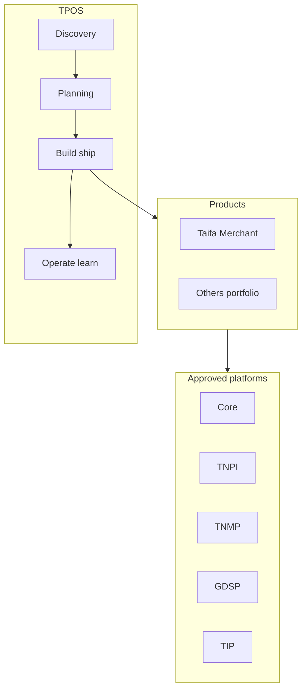

# Taifa Product Operating System (TPOS) — Charter

**Program:** Product Engineering Phase  
**Status:** **Mandatory** for all Taifa products (current and future)  
**Authority:** [Enterprise Architecture](../architecture/00_ARCHITECTURE_CONSTITUTION.md) · [GOVERNANCE](../GOVERNANCE.md)  
**Date:** 2026-08-06

---

## Executive summary

**TPOS** is Taifa’s official **product development operating system**—how every product moves from **idea** to **production** and **continuous improvement**. Architecture phase is **complete**; platforms (Core, TNPI, TNMP, GDSP, TIP) are **approved**. Products **consume** platforms and **never duplicate** them.

**No product may bypass TPOS.**

---

## Mission

One disciplined framework for **discovery, planning, UX, engineering, security, QA, release, operations, and learning**—aligned with world-class product orgs (Google, Amazon, Stripe, Shopify, Atlassian) and Taifa’s national scale.

---

## Scope

| In scope | Out of scope |
| --- | --- |
| Product lifecycle, standards, templates, governance | Re-architecting TNPI/TNMP/GDSP/TIP |
| Portfolio management, maturity model | Writing product application code |
| RACI, checklists, playbooks | Replacing EARB technical constitution |

---

## Business architecture

---

## Principles

1. **Platform-first** — Identity, payments, integration, etc. are never re-built in products.  
2. **Document-driven** — Standard product pack ([03_PRODUCT_DOCUMENT_TEMPLATE.md](03_PRODUCT_DOCUMENT_TEMPLATE.md)).  
3. **Gate-based** — Reviews at charter, architecture, security, release ([10_PRODUCT_GOVERNANCE.md](10_PRODUCT_GOVERNANCE.md)).  
4. **Measurable** — Success metrics defined before MVP ([18_SUCCESS_METRICS.md](18_SUCCESS_METRICS.md)).  
5. **Accessible & secure by default** — UX and security standards are non-optional.  
6. **Continuous improvement** — Retrospectives and decision logs are living artifacts.

---

## RACI (TPOS ownership)

| Activity | CPO | VP Product | CTO | Product Lead | Eng Lead | Design | Security | QA | DevOps |
| --- | --- | --- | --- | --- | --- | --- | --- | --- | --- |
| Charter & business case | A | R | C | R | C | C | I | I | I |
| Vision & roadmap | A | R | C | R | C | C | I | I | I |
| UX / IA | C | A | I | R | C | **R** | I | C | I |
| Technical design | C | C | A | C | **R** | I | C | C | C |
| Security review | I | I | C | C | C | I | **A** | C | C |
| Release | C | A | C | R | R | I | C | **R** | **R** |
| Operations KPIs | C | **R** | C | R | C | I | I | I | R |

*R = Responsible, A = Accountable, C = Consulted, I = Informed*

---

## Document map

| # | Document |
| --- | --- |
| 00 | [00_TPOS_CHARTER.md](00_TPOS_CHARTER.md) (this file) |
| 01–20 | See [02_PRODUCT_STANDARDS.md](02_PRODUCT_STANDARDS.md) index |

---

## Entry criteria (Product Engineering phase)

- Enterprise architecture **approved** ✅  
- Core, TNPI, TNMP, GDSP, TIP packs **approved** ✅  
- [Product Portfolio](../TAIFA_PRODUCT_PORTFOLIO_AND_DELIVERY_ROADMAP.md) published ✅  

---

## Relationship to TEOS

| System | Owns |
| --- | --- |
| **TPOS** | Product *what* — discovery, PRD, UX, PAR |
| **[TEOS](../teos/00_TEOS_CHARTER.md)** | Engineering *how* — build, test, secure, deploy, operate |

Product gates (PAR) and engineering gates (EGR, G-SEC, G-QA) chain per [TEOS lifecycle](../teos/01_ENGINEERING_LIFECYCLE.md).

---

## Cross-references

[01_PRODUCT_LIFECYCLE.md](01_PRODUCT_LIFECYCLE.md) · [12_IMPLEMENTATION_GUIDE.md](12_IMPLEMENTATION_GUIDE.md) · [15_PLAYBOOK.md](15_PLAYBOOK.md) · [TEOS Charter](../teos/00_TEOS_CHARTER.md)
