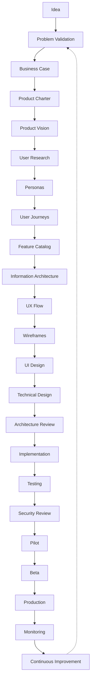

# 01 — Product Lifecycle

---

## Executive summary

Official **Taifa product lifecycle** from idea through continuous improvement—mandatory stages, gates, and artifacts.

---

## Lifecycle diagram

---

## Stage definitions

| Stage | Purpose | Key outputs | Gate |
| --- | --- | --- | --- |
| **Idea** | Capture opportunity | Idea brief | — |
| **Problem validation** | Confirm pain is real | Research summary | G-Discovery |
| **Business case** | ROI, segments | [02_BUSINESS_CASE.md](03_PRODUCT_DOCUMENT_TEMPLATE.md) template | Product Review Board |
| **Product charter** | Mandate, scope | `00_PRODUCT_CHARTER.md` | PRB approve |
| **Product vision** | North star | `01_PRODUCT_VISION.md` | PRB |
| **User research** | Evidence | `04_USER_RESEARCH.md` | Design Review |
| **Personas & journeys** | Who / how | `03`, `05` | Design Review |
| **Feature catalog** | What we build | `06_FEATURE_CATALOG.md` | PRB prioritization |
| **IA / UX / UI** | Experience design | `07`–`11` | Design Review |
| **Technical design** | How we build | `12`–`14`, arch pack refs | **ARB** |
| **Implementation** | Build | Code, tests | Eng Review |
| **Testing** | Quality | `16_TEST_PLAN.md` | QA sign-off |
| **Security review** | Risk reduction | Threat model, `14` | **Security Board** |
| **Pilot** | Limited users | Pilot report | Release Board |
| **Beta** | Wider validation | Beta metrics | Release Board |
| **Production** | General availability | `17_RELEASE_PLAN.md` | Release Board |
| **Monitoring** | Operate | Dashboards, alerts | Ops cadence |
| **Continuous improvement** | Learn | `25_RETROSPECTIVE.md`, `24_DECISION_LOG.md` | PRB quarterly |

---

## Gate summary

| Gate | Board | When |
| --- | --- | --- |
| G-Discovery | PRB | After problem validation |
| G-Charter | PRB | Charter approved |
| G-Design | Design Review | UI sign-off before build |
| G-Architecture | ARB | Before implementation sprint 1 |
| G-Security | Security Board | Before pilot |
| G-Release | Release Board | Pilot → Beta → Prod |

---

## Maturity alignment

Stages map to [17_PRODUCT_MATURITY_MODEL.md](17_PRODUCT_MATURITY_MODEL.md) levels 1–7.

---

## Cross-references

[10_PRODUCT_GOVERNANCE.md](10_PRODUCT_GOVERNANCE.md) · [14_CHECKLISTS.md](14_CHECKLISTS.md)
