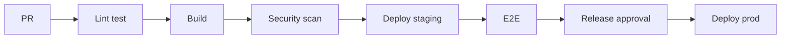

# 08 — Release Standards (DevSecOps)

---

## Executive summary

**Git, CI/CD, versioning, rollback, feature flags, observability, incident response**—standard for all products.

---

## Git & branch strategy

| Branch | Use |
| --- | --- |
| `main` | Production-ready; protected |
| `release/*` | Release hardening |
| `feature/*` | Short-lived features |
| `hotfix/*` | Production fixes |

Trunk-based preferred for libraries; GitFlow allowed for mobile release trains.

---

## CI/CD pipeline stages

---

## Versioning

- **Semver** for apps and APIs  
- **Mobile:** store versioning + minimum backend version matrix in `17_RELEASE_PLAN.md`  
- **API:** URL or header versioning per TIP policy

---

## Rollback

- Container: previous task definition < 15 min  
- Mobile: force upgrade only for critical security; otherwise n-1 supported  
- Feature flags off for bad features without redeploy

---

## Feature flags

- LaunchDarkly or Core Config service  
- Flags documented in release notes  
- Kill switch for payments always available (route to maintenance)

---

## Observability & incidents

- Dashboards per `09_OPERATIONS.md`  
- PagerDuty/on-call for L5 products  
- Postmortem template within 5 business days Sev-1

---

## Cross-references

[09_OPERATIONS.md](09_OPERATIONS.md) · [14_CHECKLISTS.md](14_CHECKLISTS.md)
