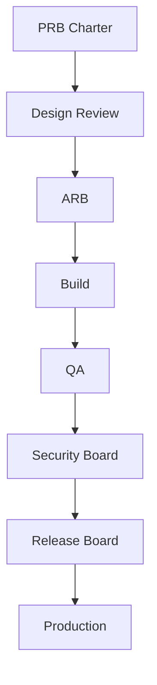

# 10 — Product Governance

---

## Executive summary

Governance boards and reviews for architecture, product, security, release, design, engineering, documentation.

---

## Boards

| Board | Chair | Purpose |
| --- | --- | --- |
| **Architecture Review Board (ARB)** | Principal Architect | Platform alignment, technical design |
| **Product Review Board (PRB)** | CPO / VP Product | Charter, roadmap, prioritization |
| **Security Review Board** | CISO / Security Lead | Threat models, pen tests |
| **Release Board** | VP Eng + Product | Pilot/Beta/Prod go-live |
| **Design Review** | Design Director | UX/UI sign-off |
| **Engineering Review** | CTO delegate | Code quality, DoD |
| **Documentation Review** | Product Ops | TPOS pack completeness |

---

## Governance flow

---

## Meeting cadence

| Board | Cadence |
| --- | --- |
| PRB | Bi-weekly |
| ARB | Weekly |
| Security | Weekly + ad hoc |
| Release | Per release train |
| Design | Weekly |

---

## Escalation

Product blocked on platform → TIP/Core/TNPI platform owner via portfolio PMO.

---

## Cross-references

[19_DECISION_FRAMEWORK.md](19_DECISION_FRAMEWORK.md) · [GOVERNANCE](../GOVERNANCE.md)
