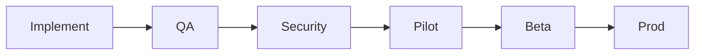

# 15 — Playbook

---

## Executive summary

**Day-to-day playbook** for product teams using TPOS—from idea to production in actionable steps.

---

## New product (0 → charter)

1. Log idea in portfolio backlog ([11_PORTFOLIO_MANAGEMENT.md](11_PORTFOLIO_MANAGEMENT.md))  
2. Run discovery checklist ([14_CHECKLISTS.md](14_CHECKLISTS.md))  
3. Draft `02_BUSINESS_CASE.md` → PRB  
4. On approval: create `docs/products/{slug}/` from [13_TEMPLATES.md](13_TEMPLATES.md)  
5. Complete `00_PRODUCT_CHARTER.md` → PRB sign-off  

---

## Design sprint (charter → build-ready)

1. User research plan → `04`  
2. Personas `03`, journeys `05`  
3. Feature catalog `06` — MoSCoW  
4. IA `07`, navigation `08`, UX flows `09`  
5. UI guidelines `10`, component map `11`  
6. **Design Review** → proceed  

---

## Engineering kickoff

1. `12_API_USAGE.md` — platform contracts only  
2. `13_DATA_MODEL.md` — product SoR  
3. `14_SECURITY_MODEL.md` draft  
4. **ARB** → sprint 1 allowed  
5. `19_BACKLOG.md` + `20_MVP.md` locked for sprint scope  

---

## Ship path

Each transition: checklist + board per [10_PRODUCT_GOVERNANCE.md](10_PRODUCT_GOVERNANCE.md).

---

## Post-launch

- Weekly KPI review (`22`, `09`)  
- Monthly retro → `25`  
- Quarterly PRB roadmap refresh `18`  

---

## Escalations

| Issue | Escalate to |
| --- | --- |
| TNPI/TIP blocker | Platform PMO + Release Board |
| Security Sev-1 | Security Board + incident process |
| Scope creep | PRB |

---

## Cross-references

[12_IMPLEMENTATION_GUIDE.md](12_IMPLEMENTATION_GUIDE.md)
