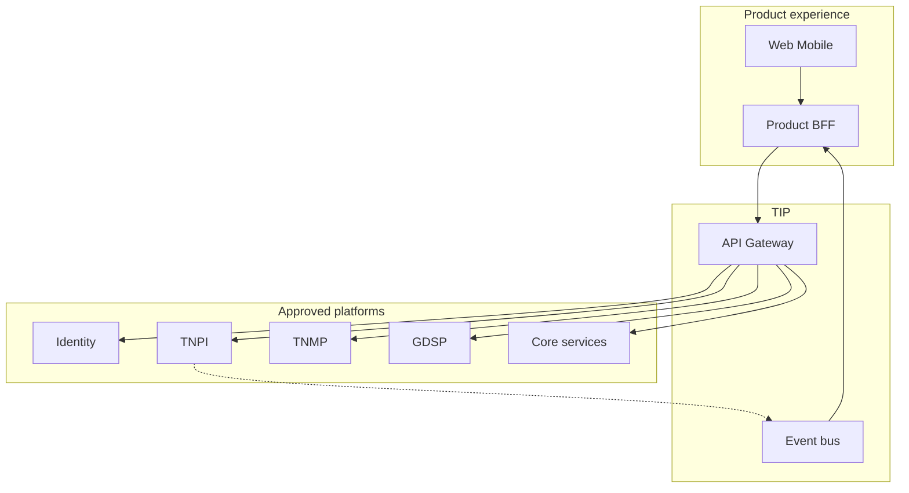

# 16 — Reference Architecture

---

## Executive summary

**Reference architecture** for Taifa products—logical view; enterprise platforms unchanged.

---

## Logical architecture

---

## Product BFF responsibilities

- Session and UX aggregation  
- RBAC enforcement (claims from Identity)  
- Caching (short TTL) for dashboards  
- **Not:** payment routing, KYB SoR, gov workflow engine  

---

## Deployment pattern

- ECS Fargate BFF + workers  
- RDS product schema  
- Redis optional  
- CloudFront static assets  
- All ingress via TIP  

---

## Cross-product patterns

| Pattern | When |
| --- | --- |
| BFF | All mobile/web products |
| Event consumer worker | Payment/status updates |
| Strangler | Legacy Django modules |

---

## Authority

Detailed platform architecture remains in:

- [platform/](../platform/00_PLATFORM_OVERVIEW.md)  
- [payments/](../payments/README.md)  
- [integration/](../integration/00_PLATFORM_OVERVIEW.md)  
- [mobility/](../mobility/00_PLATFORM_OVERVIEW.md)  
- [government/](../government/00_PLATFORM_OVERVIEW.md)  

---

## Cross-references

[05_ENGINEERING_STANDARDS.md](05_ENGINEERING_STANDARDS.md)
