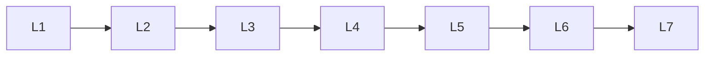

# 17 — Product Maturity Model

---

## Executive summary

**Seven maturity levels** for portfolio management and governance expectations.

---

## Levels

| Level | Name | Description | TPOS doc minimum |
| --- | --- | --- | --- |
| **L1** | Concept | Idea, initial validation | 00 draft, 02 sketch |
| **L2** | Prototype | UX/tech prototype | 00, 01, 09, 12 outline |
| **L3** | MVP | Core value shippable | L3 set in [03](03_PRODUCT_DOCUMENT_TEMPLATE.md) |
| **L4** | Pilot | Limited production users | + 17, 21, 15, security gate |
| **L5** | Production | GA, SLOs, support | Full 00–25 maintained |
| **L6** | National rollout | Multi-region TZ | Scale runbooks, L6 KPIs |
| **L7** | Regional expansion | EAC / beyond | Localization, regulatory pack |

---

## Maturity progression

---

## Assessment

| Criterion | Weight |
| --- | --- |
| Documentation completeness | 25% |
| Platform compliance | 25% |
| KPI achievement | 25% |
| Ops readiness | 25% |

Product Ops scores quarterly; PRB approves level changes.

---

## Portfolio targets (2027 indicative)

| Product | Target EOY 2027 |
| --- | --- |
| Taifa Merchant | L4 → L5 |
| Super App shell | L3 |
| Tourism | L3 |
| GDSP UX products | L4 (with GDSP platform) |

---

## Cross-references

[11_PORTFOLIO_MANAGEMENT.md](11_PORTFOLIO_MANAGEMENT.md)
