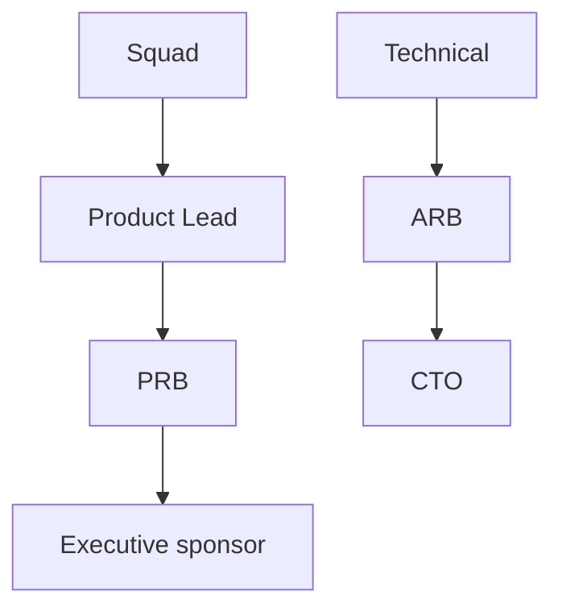

# 19 — Decision Framework

---

## Executive summary

How **product and technical decisions** are made, documented, and escalated.

---

## Decision types

| Type | Forum | Record |
| --- | --- | --- |
| Product priority | PRB | `24_DECISION_LOG.md` |
| Architecture / platform use | ARB | ADR + product `24` |
| Security exception | Security Board | ADR + risk register |
| Release go/no-go | Release Board | Release minutes |
| UX deviation from TDS | Design Review | `24` |

---

## Decision matrix (RAPID-style)

| Role | Responsibility |
| --- | --- |
| **Recommend** | Product Lead + Eng Lead |
| **Agree** | Design, Security, QA as needed |
| **Perform** | Squad |
| **Input** | Stakeholders, pilot users |
| **Decide** | PRB (product) or ARB (technical) |

---

## Escalation path

---

## One-way doors

Require **written decision** + explicit approver:

- New platform capability (not just product)  
- PII scope increase  
- Payment flow change  
- Public API contract breaking change  

Use [19_DECISION_FRAMEWORK.md](19_DECISION_FRAMEWORK.md) + platform PDL for cross-cutting items ([17_PLATFORM_DECISION_LOG.md](../platform/17_PLATFORM_DECISION_LOG.md)).

---

## Cross-references

[10_PRODUCT_GOVERNANCE.md](10_PRODUCT_GOVERNANCE.md)
