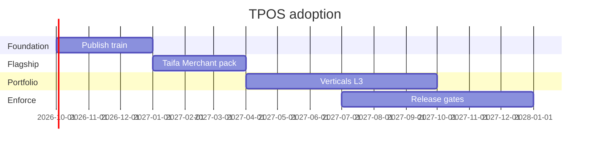

# 20 — TPOS Rollout Roadmap

---

## Executive summary

**18-month roadmap** to embed TPOS as mandatory operating model across Taifa Product Engineering.

---

## Objectives

1. 100% new products start with TPOS charter  
2. Flagship products at L3+ documentation by Q2 2027  
3. Release Board enforces gates by Q3 2027  
4. Product Ops function staffed  

---

## Roadmap

| Quarter | Milestone |
| --- | --- |
| **2026 Q4** | TPOS published; training; Merchant gap analysis |
| **2027 Q1** | `docs/products/taifa-merchant/` TPOS pack complete; Super App charter |
| **2027 Q2** | Tourism + Commerce L3; first Release Board gated beta |
| **2027 Q3** | Portfolio maturity review; automated doc lint in CI (optional) |
| **2027 Q4** | 80% portfolio L3+; retro program standardized |
| **2028 H1** | L6 playbooks for national rollout products |

---

## Dependencies

- PRB and ARB cadence established  
- Product Ops hire or assign  
- No conflict with [platform_governance](../platform_governance/00_INDEX.md) Stages 0–9  

---

## Success metrics (TPOS program)

| KPI | Target |
| --- | --- |
| Products with approved charter | 100% active products |
| Releases with security gate | 100% from Q3 2027 |
| Platform duplication incidents | 0 per year |

---

## Cross-references

[12_IMPLEMENTATION_GUIDE.md](12_IMPLEMENTATION_GUIDE.md) · [00_TPOS_CHARTER.md](00_TPOS_CHARTER.md)
