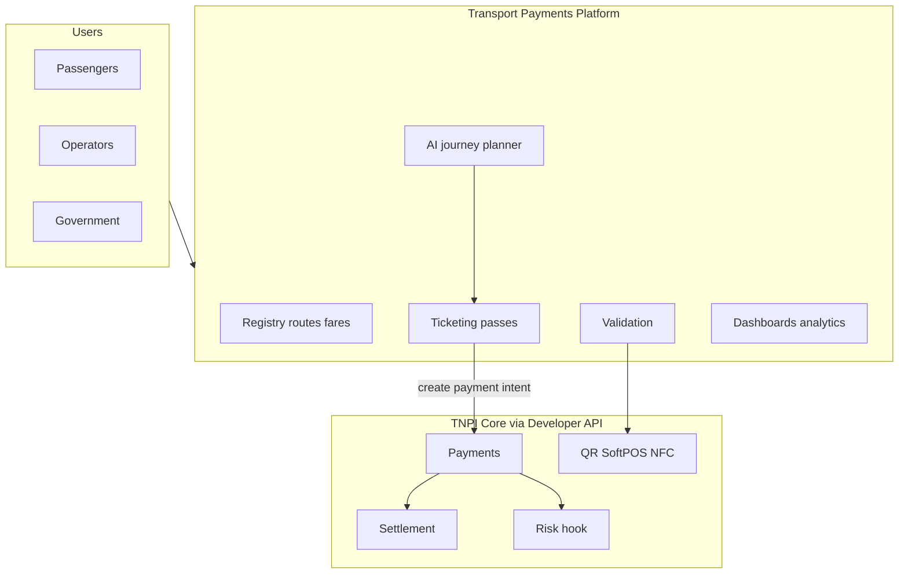
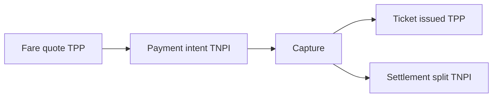
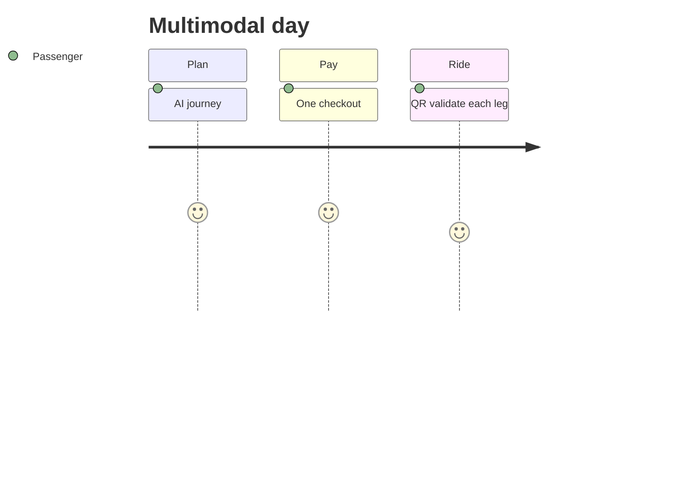

# 01 — Product Vision

---

## Executive summary

**Taifa Transport Payments Platform (TPP)** delivers one digital payment experience across all Tanzanian transport modes—ticketing, passes, validation, operator tools, government visibility, and AI multimodal journey planning—with **single checkout** and **TNPI-mediated fund distribution**.

---

## Business purpose

Reduce cash, increase transparency for operators and regulators, and let passengers plan and pay multimodal journeys once.

---

## Architecture overview

---

## Product vision

**One ticket, one payment, every ride—city to coast to corridor.**

---

## Capability map

| Domain | TPP owns | TNPI owns |
| --- | --- | --- |
| Passenger / operator onboarding (transport) | ✅ | Merchant KYC when operator = merchant |
| Routes, stops, fares | ✅ | — |
| Tickets, passes, validation | ✅ | Acceptance rails |
| Payment | — | ✅ Orchestration |
| Splits / payout | Metadata only | ✅ Settlement |
| Fraud | Hooks + velocity context | ✅ FRP |
| Refunds | Initiate with `payment_id` | ✅ Orchestration |

---

## Financial flow

---

## Passenger journey

---

## Integration

Consume Identity (passenger), Notifications (ticket), Maps (stops), AI (planner)—event-driven where possible.

---

## Security considerations

Device-bound conductor validation; inspection roles; PII minimization — [10_SECURITY_MODEL.md](10_SECURITY_MODEL.md).

---

## AWS architecture

ECS microservices + RDS mobility schema — [11_AWS_ARCHITECTURE.md](11_AWS_ARCHITECTURE.md).

---

## Operational considerations

Peak commute autoscale; offline validation sync windows.

---

## Implementation strategy

MVP BRT/dala dala → regional rail/ferry → national multimodal AI — [13_ROADMAP.md](13_ROADMAP.md).

---

## Future expansion

Toll roads · EV charging · cross-border East Africa passes.

---

## Cross-references

[02_PASSENGER_PLATFORM.md](02_PASSENGER_PLATFORM.md) · [06_AI_JOURNEY_PLANNER.md](06_AI_JOURNEY_PLANNER.md)
