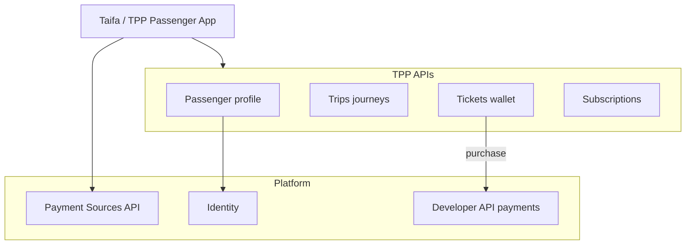
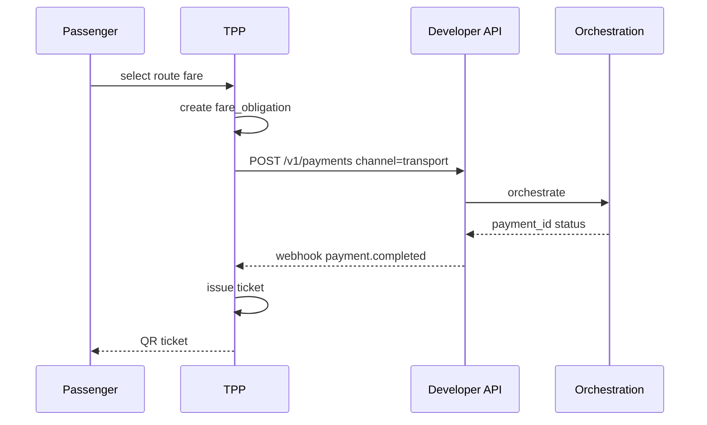

# 02 — Passenger Platform

---

## Executive summary

Passenger-facing capabilities: registration (linked to Identity), wallet integration via Payment Sources, trip/journey views, digital tickets (QR/NFC), passes, refunds/lost ticket, emergency assistance—**payments always via TNPI**.

---

## Business purpose

Single app experience for buying, holding, and using transport entitlements nationwide.

---

## Architecture overview

---

## Capabilities

| Capability | Description |
| --- | --- |
| Passenger registration | Identity subject + mobility preferences |
| Wallet integration | Tokenized sources; no float in TPP |
| Trip planning | Manual + AI planner feed |
| Digital ticketing | QR/NFC payload bound to `ticket_id` |
| Pass products | Daily / weekly / monthly / student / senior / corporate |
| Refund requests | TPP case → TNPI refund API |
| Lost ticket recovery | Identity + purchase proof → reissue token |
| Emergency assistance | Location + trip context to ops (no payment) |

---

## Sequence: buy single ticket

---

## Pass subscriptions

TPP stores pass entitlement; renewal triggers TNPI recurring payment template (orchestration contract)—not local billing engine.

---

## Fraud hooks

Pass `metadata.transport` (mode, route, device) on every payment; rely on FRP via orchestration.

---

## Security

Ticket signing keys in KMS; QR rotating barcodes optional for high-fraud routes.

---

## Operational considerations

Offline ticket cache TTL; sync validation state on reconnect.

---

## Implementation strategy

TPP-P1 passenger API + ticket wallet after TNPI sandbox E2E.

---

## Future expansion

Family accounts; accessibility fare types.

---

## Cross-references

[05_TICKETING.md](05_TICKETING.md) · [07_API_SPECIFICATION.md](07_API_SPECIFICATION.md)
