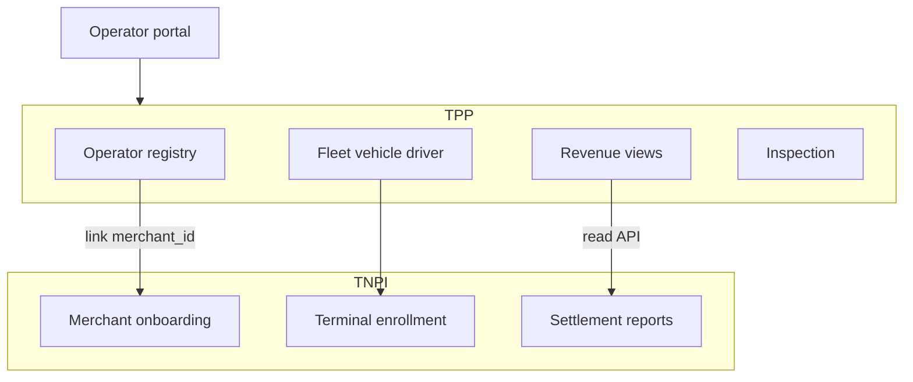
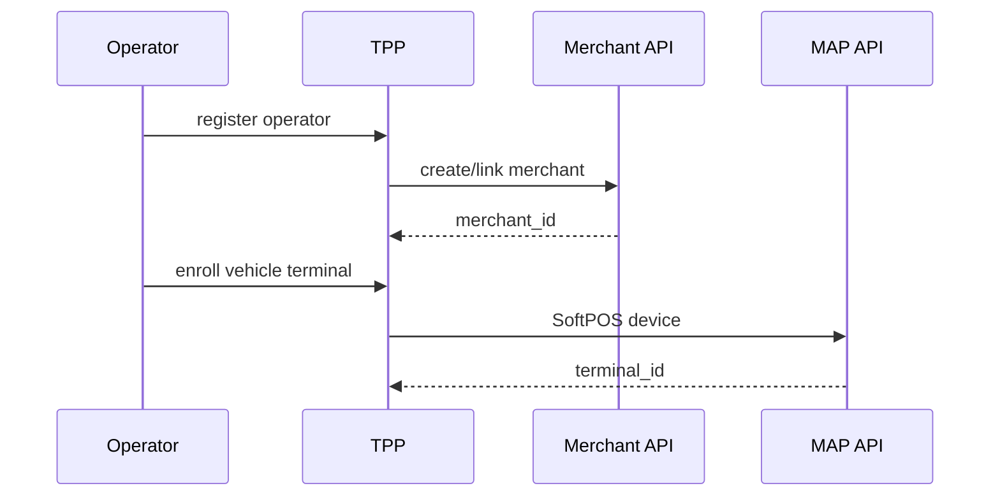

# 03 — Operator Platform

---

## Executive summary

**Operator, fleet, vehicle, driver** registry; fleet and operator dashboards; revenue views (from TNPI settlement/recon reads); inspection module; SoftPOS/NFC device enrollment via Merchant + MAP.

---

## Business purpose

Give transport operators digital operations without building payment stacks.

---

## Architecture overview

---

## Registration model

| Entity | TPP fields | TNPI link |
| --- | --- | --- |
| Operator | license, mode, zones | `merchant_id` |
| Fleet | name, depot | — |
| Vehicle | plate, capacity, mode | `terminal_id` optional |
| Driver | license, conductor flag | Identity `driver_subject_id` |

---

## Dashboards

| Dashboard | Data source |
| --- | --- |
| Fleet | TPP operational |
| Operator | TPP + TNPI settlement |
| Government | Aggregated ridership (anonymized) |
| Revenue | TNPI settlement/recon read APIs |

---

## Sequence: operator go-live

---

## Inspection module

Inspectors validate tickets via TPP (read-only ticket state); flag fraud to FRP case API (transport context)—no local fraud engine.

---

## Security

Operator RBAC; fleet-scoped data; audit driver shifts.

---

## AWS

Operator BFF on Fargate; reports cached from TNPI.

---

## Implementation strategy

TPP-O1 registry; TPP-O2 dashboards after settlement read routes live.

---

## Future expansion

Franchise sub-operators; dynamic pricing approvals.

---

## Cross-references

[04_ROUTE_MANAGEMENT.md](04_ROUTE_MANAGEMENT.md) · [03_OPERATOR_PLATFORM.md](03_OPERATOR_PLATFORM.md)
