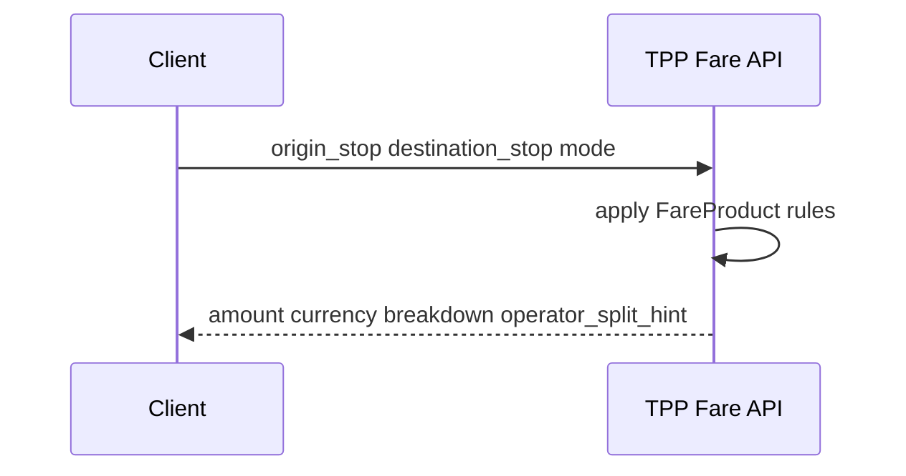

# 04 — Route Management

---

## Executive summary

**Routes, stops, fare products, schedules** per mode (dala dala, BRT, rail, ferry, air shuttle, taxi zones, parking lots)—canonical mobility network graph for ticketing and AI planner.

---

## Business purpose

Accurate fares and validation rules depend on authoritative route/stop data.

---

## Architecture overview

---

## Entities

| Entity | Description |
| --- | --- |
| `Route` | Mode-specific line or service |
| `Stop` | Boarding/alighting point |
| `RoutePattern` | Stop sequence + direction |
| `FareProduct` | Single, distance, zone, time-based |
| `FareRule` | Peak, student discount flags (eligibility in TPP) |

---

## Mode specifics

| Mode | Fare model |
| --- | --- |
| Dala dala / BRT | Flat or zone |
| TRC / SGR | Origin-destination pairs |
| Ferry | Route + class |
| Air / shuttle | Segment + baggage |
| Taxi / ride-hail | Zone meter hook to partner API |
| Parking | Entry/exit duration |
| Toll (future) | Gantry ID + vehicle tag |
| EV (future) | kWh or session |

---

## Sequence: fare quote

**Note:** `amount` is input to TNPI payment; split hints become settlement metadata.

---

## Government use

Read-only route feeds for planning; no payment data in route service.

---

## API

`/v1/transport/routes`, `/stops`, `/fares/quote` — [07_API_SPECIFICATION.md](07_API_SPECIFICATION.md).

---

## Security

Operator-only write; public read for published routes.

---

## Operational considerations

GTFS import pipelines; versioned route changes effective-dated.

---

## Implementation strategy

TPP-R1 BRT pilot graph; expand per roadmap wave.

---

## Future expansion

Real-time vehicle positions for dynamic fares (GTFS-RT).

---

## Cross-references

[05_TICKETING.md](05_TICKETING.md) · [06_AI_JOURNEY_PLANNER.md](06_AI_JOURNEY_PLANNER.md)
