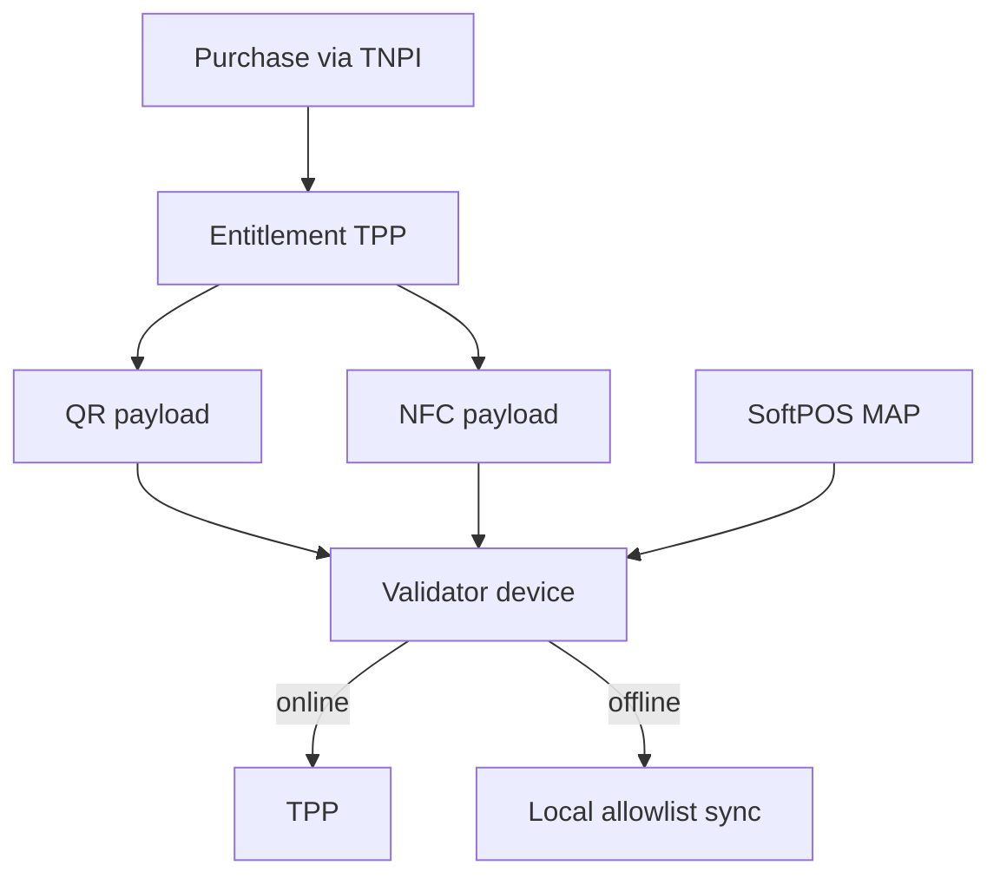
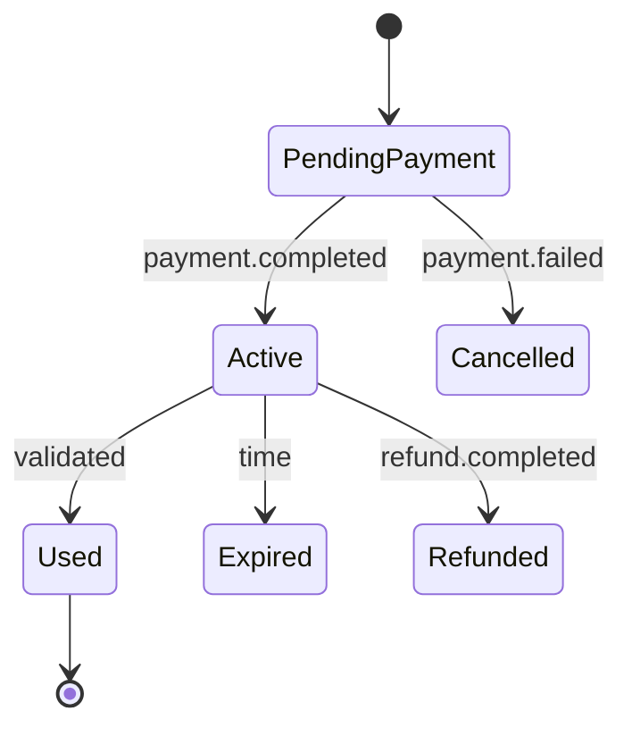
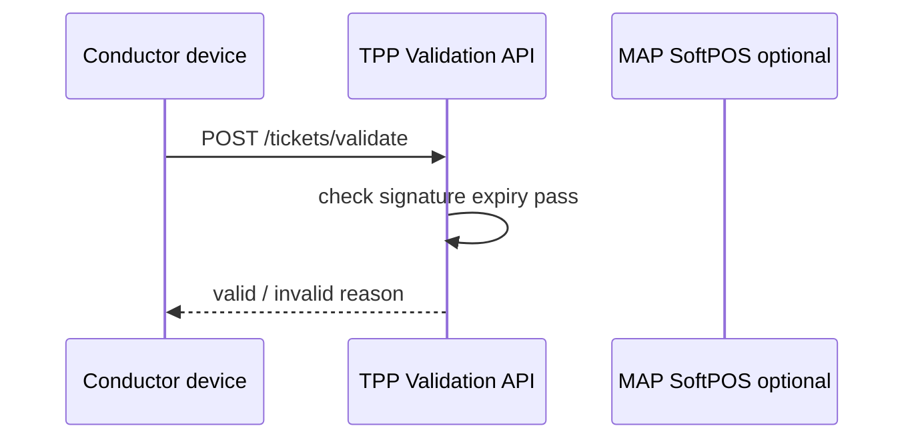

# 05 — Ticketing

---

## Executive summary

**Digital ticketing**: QR, NFC, SoftPOS validation, offline validation queues, pass entitlements, refund/lost ticket flows—all entitlements in TPP; payment state from TNPI events only.

---

## Business purpose

Tamper-resistant proof of payment at vehicle, gate, or inspector device.

---

## Architecture overview

---

## Ticket lifecycle

---

## Validation types

| Type | Channel |
| --- | --- |
| QR scan | Passenger phone or printed |
| NFC tap | Card/emulated token |
| SoftPOS | Conductor validates against TPP |
| Offline | Signed ticket + periodic revocation list |

---

## Sequence: validate on bus

Payment already captured; validation is **entitlement check**, not charge.

---

## Pass products

| Pass | Validation rule |
| --- | --- |
| Daily | Calendar day + mode set |
| Weekly / Monthly | Rolling period |
| Student / Senior | Identity eligibility flag |
| Corporate | Org billing account linked merchant |

---

## Refund management

TPP creates refund request → `POST /v1/payments/{id}/refund` via Developer API; ticket → `Refunded` on `refund.completed` event.

---

## Lost ticket recovery

Identity verification + `payment_id` lookup (TNPI read) + reissue new `ticket_id` (invalidate old).

---

## Security

HMAC/JWT ticket payload; revocation list; rate limit validation API.

---

## AWS

High-read validation service; CloudFront for revocation bundles to devices.

---

## Implementation strategy

TPP-T1 QR BRT; TPP-T2 offline bundle; TPP-T3 NFC pilot.

---

## Future expansion

EMV transit kernel integration via MAP only.

---

## Cross-references

[02_PASSENGER_PLATFORM.md](02_PASSENGER_PLATFORM.md) · [08_EVENT_CATALOG.md](08_EVENT_CATALOG.md)
