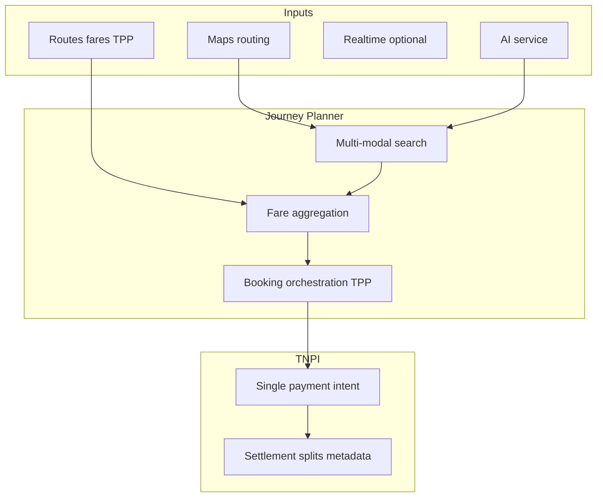
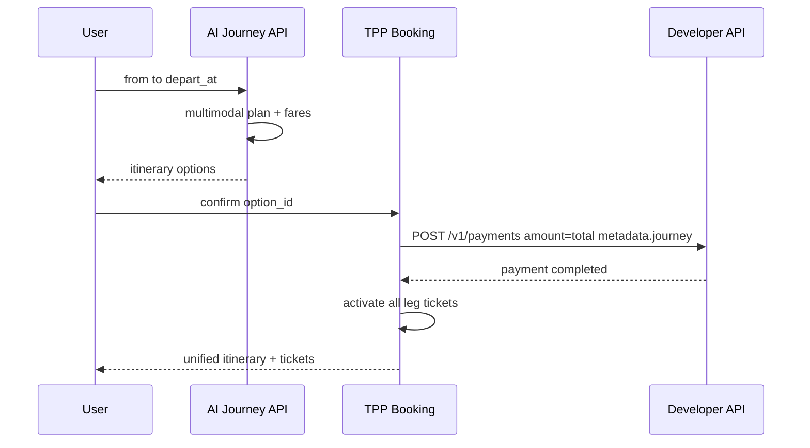

# 06 — AI Journey Planner

---

## Executive summary

**AI multimodal journey planner**: plan legs across modes, estimate time and fare, book required segments, produce **one itinerary** and trigger **one TNPI payment** (or pass coverage), with settlement distribution defined in payment metadata—not in TPP ledger.

---

## Business purpose

National mobility UX differentiator: Dar es Salaam BRT + dala dala + ferry in one flow.

---

## Architecture overview

---

## Planner outputs

| Output | Owner |
| --- | --- |
| Itinerary JSON | TPP |
| Per-leg tickets (pending) | TPP |
| Total fare | TPP quote |
| `payment_id` | TNPI |
| Fund distribution | TNPI settlement from `metadata.splits[]` |

---

## Sequence: plan and pay once

---

## AI responsibilities

- Rank options (time, cost, transfers)  
- Natural language query → structured trip request  
- Explain delays (when RT feed exists)  
- **Does not** move money or calculate settlement—only proposes splits for TNPI validation  

---

## Fare calculation

Sum leg `FareProduct` quotes; apply pass coverage if active entitlement; remainder → single payment.

---

## Booking

Atomic **journey_booking_id**; partial failure → compensating refunds via TNPI (saga owned by TPP orchestration layer, not payment engine).

---

## Integration

| Service | Use |
| --- | --- |
| Maps | Walk/drive to stop, geocoding |
| AI | LLM + routing optimizer |
| Notifications | Itinerary updates |
| FRP | High-value multimodal flag via metadata |

---

## Security

No PII in model logs; opt-in location.

---

## Operational considerations

Fallback to rule-based planner if AI unavailable.

---

## Implementation strategy

Phase 3 roadmap: rule-based multimodal → AI ranking → voice NLU.

---

## Future expansion

Carbon estimate; accessibility preferences.

---

## Cross-references

[04_ROUTE_MANAGEMENT.md](04_ROUTE_MANAGEMENT.md) · [13_ROADMAP.md](13_ROADMAP.md)
