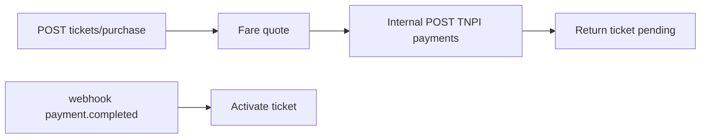

# 07 — API Specification

**Public edge:** [Developer Platform](../payments/developer-platform/03_API_PLATFORM.md) `/v1/transport/*`  
**Internal base:** `/api/v1/mobility` (service-to-service)

---

## Executive summary

Transport-specific REST APIs: passengers, operators, routes, fares, tickets, validation, passes, journeys, inspections—**payment endpoints proxied to TNPI**, not redefined here.

---

## Business purpose

Stable contracts for apps, operators, and government integrators.

---

## TNPI delegation (use these, do not duplicate)

| Need | Call |
| --- | --- |
| Pay fare | `POST /v1/payments` (`channel: transport`) |
| Refund | `POST /v1/payments/{id}/refund` |
| QR/SoftPOS | `/v1/acceptance/*` |
| Settlement report | `/v1/settlements/*` read |
| Risk | Automatic via orchestration |

---

## Transport APIs (TPP-owned)

### Passengers

| Method | Path | Description |
| --- | --- | --- |
| POST | `/v1/transport/passengers` | Register link identity |
| GET | `/v1/transport/passengers/me` | Profile |
| GET | `/v1/transport/passengers/me/tickets` | Wallet |
| GET | `/v1/transport/passengers/me/passes` | Subscriptions |

### Operators & fleet

| Method | Path |
| --- | --- |
| POST | `/v1/transport/operators` |
| GET | `/v1/transport/operators/{id}` |
| POST | `/v1/transport/operators/{id}/fleets` |
| POST | `/v1/transport/fleets/{id}/vehicles` |
| POST | `/v1/transport/vehicles/{id}/drivers` |

### Routes & fares

| Method | Path |
| --- | --- |
| GET | `/v1/transport/routes` |
| GET | `/v1/transport/stops` |
| POST | `/v1/transport/fares/quote` |

### Ticketing

| Method | Path |
| --- | --- |
| POST | `/v1/transport/tickets/purchase` | Creates obligation + TNPI payment |
| GET | `/v1/transport/tickets/{id}` |
| POST | `/v1/transport/tickets/validate` |
| POST | `/v1/transport/tickets/{id}/recover` |

### Passes

| Method | Path |
| --- | --- |
| GET | `/v1/transport/passes/products` |
| POST | `/v1/transport/passes/subscribe` |

### Journeys (AI)

| Method | Path |
| --- | --- |
| POST | `/v1/transport/journeys/plan` |
| POST | `/v1/transport/journeys/{id}/confirm` |

### Operations

| Method | Path |
| --- | --- |
| GET | `/v1/transport/operators/{id}/revenue` | TNPI-backed aggregate |
| POST | `/v1/transport/inspections/scan` |

---

## Payment metadata schema (required on TNPI calls)

```json
{
  "channel": "transport",
  "transport": {
    "mode": "brt",
    "operator_id": "uuid",
    "route_id": "uuid",
    "ticket_id": "uuid",
    "journey_id": "uuid",
    "splits": [
      { "merchant_id": "uuid", "amount": "800", "role": "operator" },
      { "merchant_id": "uuid", "amount": "200", "role": "authority" }
    ]
  }
}
```

---

## API flow: purchase



---

## OpenAPI standards

`openapi/tpp-v1.yaml` merged into Developer Platform catalog; Spectral CI.

---

## Security

OAuth via Developer Platform; operator scopes `transport:operator:{id}`.

---

## AWS

Exposed via API Gateway route to TPP Fargate services.

---

## Implementation strategy

Implement TPP OpenAPI first; gateway proxy second.

---

## Future expansion

GTFS-RT feeds API; partner taxi dispatch webhooks.

---

## Cross-references

[08_EVENT_CATALOG.md](08_EVENT_CATALOG.md) · [09_DATABASE_MODEL.md](09_DATABASE_MODEL.md)
