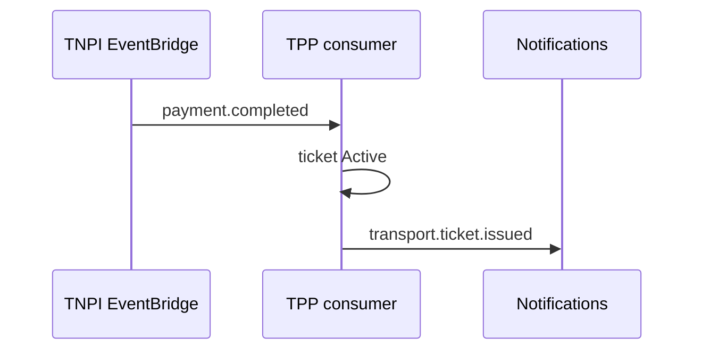

# 08 — Event Catalog

**Topic prefix:** `taifa.transport` · **Bus:** `tnpi-platform` (subscribe) / publish TPP events

---

## Executive summary

Transport domain events for tickets, journeys, operators, validation—**subscribe to TNPI** `payment.*` for financial state; never emit payment settlement events from TPP.

---

## Business purpose

Decouple passenger apps, operators, analytics, and notifications from synchronous APIs.

---

## TPP publishes

| Event | When |
| --- | --- |
| `transport.passenger.registered` | Passenger profile created |
| `transport.operator.registered` | Operator record + merchant link |
| `transport.vehicle.enrolled` | Vehicle active |
| `transport.route.published` | Route version live |
| `transport.fare.updated` | Fare product change |
| `transport.ticket.issued` | Entitlement active |
| `transport.ticket.validated` | Successful scan |
| `transport.ticket.expired` | TTL reached |
| `transport.pass.activated` | Subscription live |
| `transport.journey.planned` | Itinerary options |
| `transport.journey.booked` | All legs committed |
| `transport.inspection.flagged` | Inspector alert |
| `transport.refund.requested` | TPP initiated TNPI refund |
| `transport.emergency.triggered` | Assistance request |

---

## TPP subscribes (TNPI / platform)

| Event | Action |
| --- | --- |
| `payment.completed` | Activate ticket/pass |
| `payment.failed` | Cancel pending ticket |
| `refund.completed` | Mark ticket refunded |
| `merchant.approved` | Enable operator go-live |
| `settlement.batch.completed` | Refresh operator revenue cache |

---

## Sequence: ticket activation

---

## Fraud hooks

Include `assessment_id` from payment payload in ticket record for investigations; escalate via FRP APIs (read), not local scoring.

---

## Security

No card data in events; ticket tokens as IDs only.

---

## AWS

EventBridge rules → SQS → TPP workers; idempotent `payment_id` handler.

---

## Implementation strategy

Register schemas in platform registry; contract tests with orchestration sandbox.

---

## Future expansion

GTFS-RT vehicle position stream (separate topic).

---

## Cross-references

[payments/15_EVENT_CATALOG.md](../payments/15_EVENT_CATALOG.md) · [05_TICKETING.md](05_TICKETING.md)
