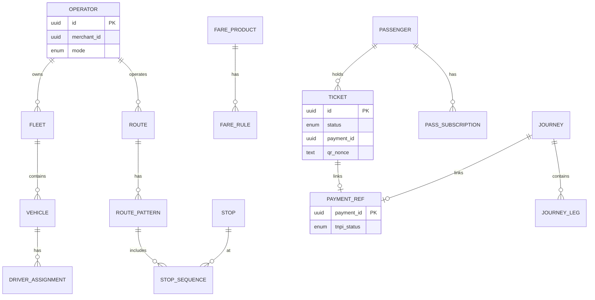

# 09 — Database Model

**Schema:** `transport_payments` (mobility)

---

## Executive summary

ER for transport registry, routes, tickets, passes, journeys, validation audit—**financial references only** (`payment_id`, `refund_id`, `merchant_id`).

---

## Business purpose

SoR for mobility entitlements and network; not for money.

---

## ER diagram

---

## Key entities

| Entity | Notes |
| --- | --- |
| `Passenger` | `identity_subject_id` |
| `Operator` / `Fleet` / `Vehicle` / `Driver` | Operational |
| `Route` / `Stop` / `FareProduct` | Network |
| `Ticket` | Entitlement |
| `PassSubscription` | Renewal refs TNPI |
| `Journey` / `JourneyLeg` | Multimodal |
| `ValidationEvent` | Append-only |
| `InspectionRecord` | Compliance |

---

## Anti-patterns (forbidden)

- Wallet balance columns  
- Local payment capture state machine duplicating orchestration  
- Settlement batch tables (read cache OK)  

---

## API / events

Align with [07_API_SPECIFICATION.md](07_API_SPECIFICATION.md) and [08_EVENT_CATALOG.md](08_EVENT_CATALOG.md).

---

## Security

Encrypt conductor device keys; row-level operator isolation.

---

## AWS

RDS PostgreSQL; PostGIS for stops; read replicas for analytics.

---

## Implementation strategy

Partition `validation_event` by month; archive to data lake.

---

## Future expansion

Toll tag registry table linking vehicle → pass.

---

## Cross-references

[04_ROUTE_MANAGEMENT.md](04_ROUTE_MANAGEMENT.md)
