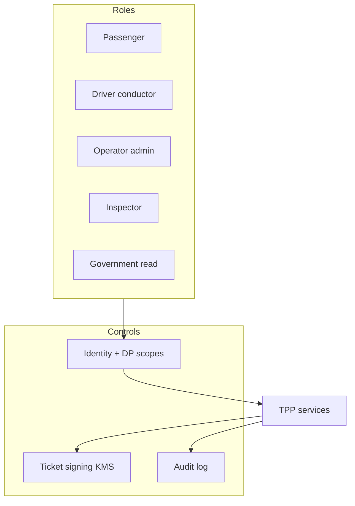

# 10 — Security Model

---

## Executive summary

RBAC/ABAC for passengers, operators, drivers, inspectors, government; ticket cryptography; API scopes via Developer Platform; PCI scope minimization; fraud via TNPI FRP; emergency data handling.

---

## Business purpose

Transport is high-volume public surface—secure entitlements without expanding PCI scope.

---

## Architecture overview

---

## Role matrix

| Role | Access |
| --- | --- |
| Passenger | Own tickets/passes/journeys |
| Driver | Validate + assigned vehicle |
| Operator admin | Fleet, routes, revenue read |
| Inspector | Scan + flag (no refunds) |
| Government | Aggregated analytics |

---

## Ticket security

- Signed payload (Ed25519 or ES256)  
- Short-lived dynamic QR optional  
- Revocation list for refunds/fraud  

---

## Fraud detection hooks

High-velocity validation → metadata to FRP via orchestration on **purchase**, not on each scan (volume); anomaly rules on inspection flags.

---

## PCI

All card/mobile money via TNPI; TPP never stores PAN.

---

## Data retention

Validation logs 2y; tickets 7y audit sample; location minimized.

---

## AWS

KMS CMK; Secrets Manager device credentials; WAF on public routes.

---

## Operational considerations

Lost device revoke conductor credentials in &lt; 15 min SLA.

---

## Implementation strategy

Security review per wave before city go-live.

---

## Future expansion

Hardware SE for NFC terminals (MAP-owned).

---

## Cross-references

[payments/fraud-risk/10_SECURITY_MODEL.md](../payments/fraud-risk/10_SECURITY_MODEL.md)
