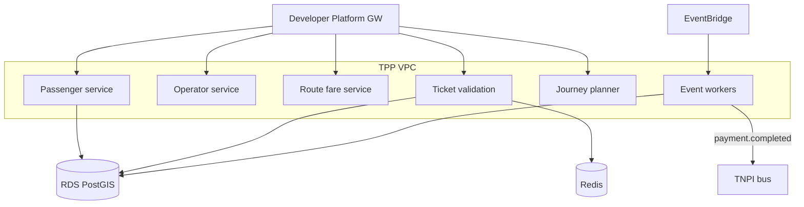
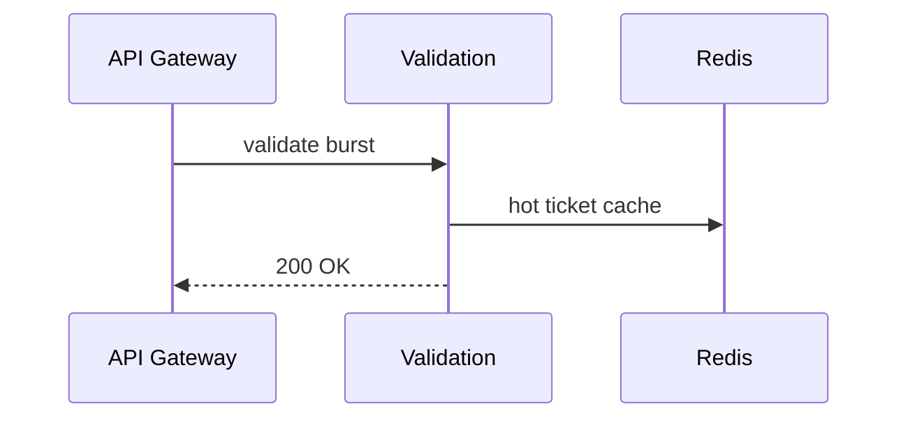

# 11 — AWS Architecture

---

## Executive summary

TPP on AWS: **ECS Fargate** microservices, **RDS PostgreSQL** + PostGIS, **Redis** (validation cache, revocation), **EventBridge** + **SQS**, **API Gateway** (via Developer Platform), **CloudWatch**, **KMS**, integration with Maps/AI/Identity as managed services.

---

## Business purpose

Scale morning/evening peaks; regional presence for corridors (Dar, Dodoma, Mwanza).

---

## Architecture overview

---

## Services

| Service | Scaling trigger |
| --- | --- |
| Validation | CPU + RPS 7–9am |
| Route/fare | Moderate |
| Journey planner | AI latency bound |
| Workers | Queue depth |

---

## Sequence: peak commute

---

## TNPI connectivity

Private VPC endpoints to TNPI internal ALB / Developer proxy—no public payment keys in TPP pods.

---

## Maps & AI

External APIs via VPC egress allowlist; cache geocode results.

---

## DR

Multi-AZ RDS; validation degrade to offline bundle mode documented.

---

## Security

Private subnets; no direct internet from data tier.

---

## Operational considerations

CloudWatch SLOs per city rollout.

---

## Implementation strategy

Terraform `taifa-transport`; reuse Taifa Core network.

---

## Future expansion

Edge validation appliance sync (ferry terminals).

---

## Cross-references

[12_IMPLEMENTATION_GUIDE.md](12_IMPLEMENTATION_GUIDE.md)
