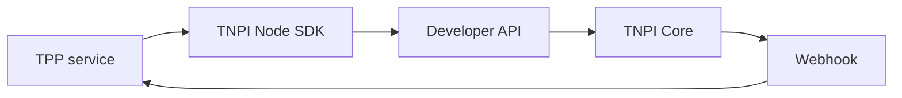

# 12 — Implementation Guide

---

## Executive summary

Implement TPP as **mobility microservices** behind Developer Platform routes; integrate TNPI via client SDK; event-driven ticket activation; **zero payment logic** in TPP beyond orchestration client calls.

---

## Business purpose

Clear build order from pilot to nationwide without re-platforming TNPI.

---

## Prerequisites

| Gate | Requirement |
| --- | --- |
| TNPI Core | Phases 1–8 available in staging/prod |
| Developer Platform | `/v1/payments`, `/v1/acceptance`, webhooks |
| Identity | Passenger + operator subjects |
| Notifications | Ticket delivery |
| Maps | Stops geocoding (wave 2+) |

---

## Service map

| Service | Responsibility |
| --- | --- |
| `tpp-passenger` | Profile, wallet UI backend |
| `tpp-operator` | Registry, dashboards |
| `tpp-network` | Routes, stops, fares |
| `tpp-ticketing` | Tickets, passes, validation |
| `tpp-journey` | Planner + booking saga |
| `tpp-worker` | TNPI event consumers |
| `tpp-analytics` | Ridership aggregates |

---

## TNPI integration pattern

1. Create fare obligation in TPP.  
2. Call `POST /v1/payments` with transport metadata + splits.  
3. Return pending ticket to user.  
4. On `payment.completed`, worker activates ticket.  
5. Settlement/recon: operator portal calls read APIs only.

---

## Journey booking saga (TPP-owned)

On partial leg failure after payment: initiate TNPI partial refunds per leg—saga state in `journey_booking` table, not in payment DB.

---

## Offline validation

Periodic sync: revocation list + allowed ticket hashes; conflict resolution on reconnect (server wins).

---

## AI planner

Start rule-based graph search; plug AI service for ranking/NLU behind feature flag.

---

## Security implementation

KMS ticket keys; conductor device enrollment through MAP.

---

## Testing

- Contract tests: TNPI sandbox payments  
- Load: validation 5k RPS target Dar BRT  
- Chaos: TNPI webhook delay  

---

## Team topology

| Squad | Owns |
| --- | --- |
| Mobility core | Routes, ticketing |
| Mobility ops | Operator portal |
| Platform integrators | TNPI client, events |

---

## Implementation strategy

Follow [13_ROADMAP.md](13_ROADMAP.md) waves; track [14_BACKLOG.md](14_BACKLOG.md).

---

## Future expansion

Per-city configuration packs (GTFS import).

---

## Cross-references

[15_ACCEPTANCE_CRITERIA.md](15_ACCEPTANCE_CRITERIA.md) · [16_DEFINITION_OF_DONE.md](16_DEFINITION_OF_DONE.md)
