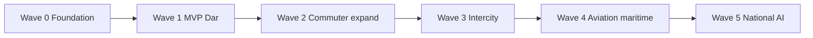
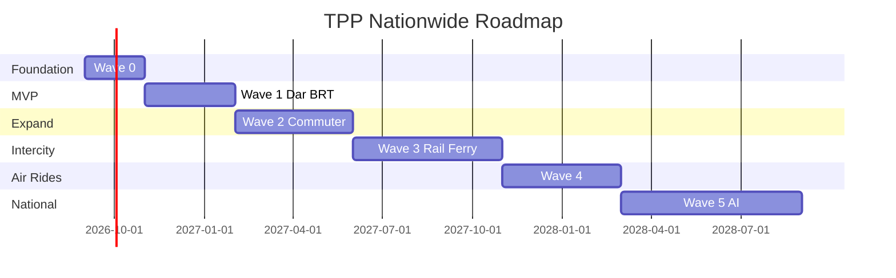

# 13 — Roadmap (MVP → Nationwide)

---

## Executive summary

**24-month indicative roadmap** from Dar BRT/dala dala MVP to nationwide multimodal AI journeys—all payments via TNPI Core.

---

## Business purpose

Phased risk reduction: prove ticket+pay+split, then expand modes and regions.

---

## Roadmap overview

---

## Wave 0 — Foundation (Months 1–2)

| Deliverable | Outcome |
| --- | --- |
| TPP IaC + RDS schema | Environments ready |
| TNPI client + webhook consumer | `payment.completed` → ticket |
| Operator ↔ `merchant_id` linking | Settlement path |
| Developer `/v1/transport` proxy | Public edge |
| BRT route seed (pilot corridor) | Fare quotes |

**Exit:** Sandbox E2E ticket purchase.

---

## Wave 1 — MVP Dar es Salaam (Months 3–5)

| Mode | Capability |
| --- | --- |
| BRT | QR tickets, gate validation |
| Dala dala | Conductor SoftPOS validation |
| Passengers | Register, buy single ride |
| Operators | Fleet + basic dashboard |
| Government | Pilot ridership dashboard |

**KPIs:** 50k tickets/month; &lt;2% failed activations; p99 validation &lt;300ms.

---

## Wave 2 — Commuter expansion (Months 6–9)

| Add | Capability |
| --- | --- |
| Bajaji / bodaboda | Zone fares + QR |
| Parking | Entry/exit sessions |
| Passes | Daily + weekly |
| Offline validation | Dala dala corridors |
| Fraud hooks | Transport metadata on all payments |

**Regions:** Dar full + Morogoro pilot.

---

## Wave 3 — Intercity rail & ferry (Months 10–14)

| Add | Capability |
| --- | --- |
| TRC / SGR | OD fares, seat class metadata |
| Ferries | Route/class tickets |
| Student / senior passes | Identity eligibility |
| Reconciliation views | Operator finance portal (TNPI read) |
| Corporate passes | B2B billing merchant |

**KPIs:** 3 operator merchants live on settlement splits.

---

## Wave 4 — Aviation & ride-hail (Months 15–18)

| Add | Capability |
| --- | --- |
| Domestic airlines / airport shuttle | Segment tickets |
| Taxi / ride-hail | Partner API adapter |
| Inspection module | Full rollout |
| Refund / lost ticket | Self-service |
| Emergency assistance | MVP |

**Regions:** Zanzibar ferry + JNIA shuttle.

---

## Wave 5 — Nationwide & AI (Months 19–24)

| Add | Capability |
| --- | --- |
| AI journey planner | Multimodal one-pay |
| Monthly subscriptions | All modes in city bundles |
| Govt national dashboard | Anonymized aggregates |
| Toll / EV (design pilot) | Tag registry only |
| Load testing | National scale drill |

**KPIs:** 10+ cities; 1M+ tickets/month; AI planner 30% of multimodal bookings.

---

## Gantt (indicative)

---

## Dependencies per wave

| Wave | TNPI / platform |
| --- | --- |
| 0–1 | Developer payments, MAP QR/SoftPOS, merchant |
| 2 | FRP stable; webhook SLAs |
| 3 | Settlement splits metadata contract |
| 4 | Partner certification transport track |
| 5 | AI platform SLA; maps nationwide graph |

---

## Operational considerations

City war rooms for launch weekends; rollback = disable purchase, honor active tickets.

---

## Implementation strategy

Align sprints to [14_BACKLOG.md](14_BACKLOG.md) TPB-* items per wave.

---

## Future expansion

East Africa reciprocal passes; carbon reporting.

---

## Cross-references

[14_BACKLOG.md](14_BACKLOG.md) · [01_PRODUCT_VISION.md](01_PRODUCT_VISION.md)
