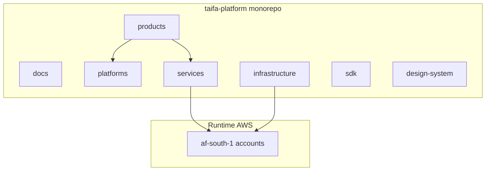

# Architecture — taifa-platform

**Repository-level architecture view.** Technical law remains [Architecture Constitution](../docs/architecture/00_ARCHITECTURE_CONSTITUTION.md).

---

## Executive summary

`taifa-platform` is a **monorepo** organizing **platforms** (shared national capability), **products** (user-facing applications), **services** (deployable runtimes), **shared** assets, **SDKs**, **infrastructure**, and **documentation** under one governance model.

---

## Ecosystem diagram

---

## Approved platforms (documentation roots)

| Platform | Path | Doc hub |
| --- | --- | --- |
| Taifa Core | `platforms/taifa-core/` | [docs/platform](../docs/platform/00_PLATFORM_OVERVIEW.md) |
| TNPI | `platforms/tnpi/` | [docs/payments](../docs/payments/README.md) |
| TNMP | `platforms/tnmp/` | [docs/mobility](../docs/mobility/00_PLATFORM_OVERVIEW.md) |
| GDSP | `platforms/gdsp/` | [docs/government](../docs/government/00_PLATFORM_OVERVIEW.md) |
| TIP | `platforms/tip/` | [docs/integration](../docs/integration/00_PLATFORM_OVERVIEW.md) |
| Identity | `platforms/identity/` | Core Identity module |
| Notifications | `platforms/notifications/` | Core |
| Analytics | `platforms/analytics/` | Core / product plans |
| AI | `platforms/ai/` | Core AI gateway |

---

## Products (TPOS)

Under `products/` — each folder follows [TPOS](../docs/tpos/03_PRODUCT_DOCUMENT_TEMPLATE.md). Flagship: [Taifa Merchant](../docs/taifa-merchant/00_INDEX.md).

---

## Services vs platforms

| Term | Meaning in this repo |
| --- | --- |
| **platforms/** | Specifications, contracts, IaC modules owned by platform squads |
| **services/** | Deployable service **code** boundaries (when implemented) |
| **products/** | Product apps (BFF, web, mobile features) + TPOS docs |

---

## Integration backbone

All north-south API and event traffic targets **[TIP](../docs/integration/00_PLATFORM_OVERVIEW.md)** at runtime.

---

## Cross-references

[docs/engineering/ARCHITECTURE_GUIDELINES.md](docs/engineering/ARCHITECTURE_GUIDELINES.md) · [REPOSITORY_TREE.md](docs/engineering/REPOSITORY_TREE.md)
