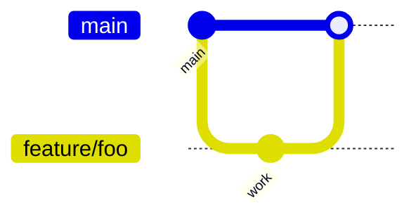

# Git workflow

---

## Branches

| Branch | Purpose |
| --- | --- |
| `main` | Production-aligned; protected |
| `release/{version}` | Hardening |
| `feature/{ticket}-{slug}` | Features |
| `fix/{ticket}-{slug}` | Bugs |
| `chore/{slug}` | Tooling/docs |

---

## Flow

---

## Pull requests

- Link ticket / charter section  
- Fill PR template  
- Squash merge preferred for features

---

## Hotfix

`hotfix/*` from `release/*` or `main` → cherry-pick to `main` per [RELEASE_STRATEGY.md](RELEASE_STRATEGY.md)

---

## Cross-references

[BRANCH_STRATEGY.md](BRANCH_STRATEGY.md) · [COMMIT_STANDARDS.md](COMMIT_STANDARDS.md)
