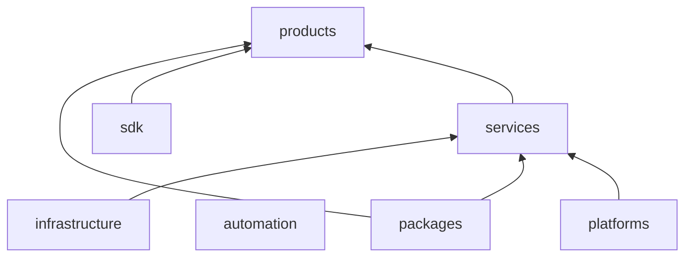

# Repository tree — taifa-platform

**Canonical monorepo layout.** Expand only via **ARB** approval.

---

## Full tree (logical)

```
taifa-platform/
├── README.md
├── ARCHITECTURE.md
├── ROADMAP.md
├── CONTRIBUTING.md
├── CODE_OF_CONDUCT.md
├── SECURITY.md
├── CHANGELOG.md
├── LICENSE
│
├── docs/
│   ├── README.md
│   ├── architecture/          → links + ADRs
│   ├── platforms/
│   ├── products/
│   ├── engineering/
│   ├── security/
│   ├── governance/
│   ├── roadmaps/
│   ├── standards/
│   ├── playbooks/
│   ├── decisions/
│   ├── diagrams/
│   ├── apis/
│   └── runbooks/
│
├── platforms/
│   ├── taifa-core/
│   ├── tnpi/
│   ├── tnmp/
│   ├── gdsp/
│   ├── tip/
│   ├── identity/
│   ├── notifications/
│   ├── analytics/
│   └── ai/
│
├── products/
│   ├── merchant/
│   ├── tourism/
│   ├── mobility/
│   ├── government/
│   ├── trade/
│   ├── commerce/
│   ├── health/
│   ├── education/
│   ├── agriculture/
│   ├── energy/
│   ├── mining/
│   ├── logistics/
│   └── future/
│
├── shared/
│   ├── ui/
│   ├── components/
│   ├── utilities/
│   ├── themes/
│   ├── constants/
│   ├── hooks/
│   ├── models/
│   ├── types/
│   ├── security/
│   └── analytics/
│
├── sdk/
│   ├── flutter/
│   ├── android/
│   ├── ios/
│   ├── web/
│   ├── javascript/
│   ├── node/
│   ├── java/
│   ├── python/
│   ├── dotnet/
│   ├── go/
│   └── php/
│
├── design-system/
│   ├── tokens/
│   ├── components/
│   ├── icons/
│   ├── typography/
│   ├── colors/
│   ├── spacing/
│   ├── motion/
│   ├── figma/
│   └── guidelines/
│
├── apis/
│   ├── openapi/                 # Aggregated OpenAPI (TIP registry)
│   ├── graphql/                 # Optional federated schemas
│   ├── events/                  # Event schema registry
│   └── contracts/               # Pact / asyncapi
│
├── packages/
│   ├── common/
│   ├── core/
│   ├── authentication/
│   ├── networking/
│   ├── storage/
│   ├── logging/
│   └── configuration/
│
├── services/
│   ├── identity/
│   ├── payments/
│   ├── notifications/
│   ├── maps/
│   ├── search/
│   ├── media/
│   ├── analytics/
│   ├── audit/
│   └── integration/
│
├── infrastructure/
│   ├── terraform/
│   ├── aws/
│   ├── kubernetes/
│   ├── network/
│   ├── security/
│   ├── iam/
│   ├── monitoring/
│   ├── backup/
│   └── disaster-recovery/
│
├── automation/
│   ├── ci/
│   ├── cd/
│   ├── quality/
│   ├── lint/
│   ├── release/
│   └── deploy/
│
├── testing/
│   ├── unit/
│   ├── integration/
│   ├── performance/
│   ├── security/
│   ├── load/
│   └── e2e/
│
├── scripts/
├── configs/
├── examples/
├── templates/
├── tools/
└── .github/
    ├── workflows/
    ├── CODEOWNERS
    └── PULL_REQUEST_TEMPLATE.md
```

---

## Folder purpose summary

| Path | Purpose | Owner squad |
| --- | --- | --- |
| `docs/` | Law, standards, ADRs, runbooks | Product Ops + ARB |
| `platforms/` | Platform specs, modules, IaC refs | Platform squads |
| `products/` | TPOS product packs + app code | Product squads |
| `shared/` | Cross-product UI/libs | Design + Platform |
| `sdk/` | Published client SDKs | Developer Experience |
| `design-system/` | TDS tokens & components | Design Systems |
| `apis/` | Contract source of truth | TIP + Architecture |
| `packages/` | Internal shared libraries | Platform Eng |
| `services/` | Deployable microservices | Service owners |
| `infrastructure/` | Terraform, K8s, DR | DevSecOps |
| `automation/` | CI/CD pipelines | DevSecOps |
| `testing/` | Cross-cutting test harnesses | QA + Eng |
| `examples/` | Partner & developer samples | DX |
| `templates/` | TPOS / service scaffolds (no auto-gen in gate 0) | Platform Eng |

---

## Diagram: dependency flow



---

## Cross-references

[REPOSITORY_GOVERNANCE.md](../governance/REPOSITORY_GOVERNANCE.md) · [LEGACY_REPO_MAPPING.md](LEGACY_REPO_MAPPING.md)
