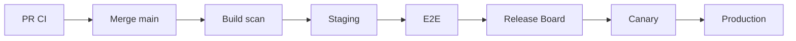

# DevSecOps — taifa-platform

**Owner:** DevSecOps Director  
**Status:** Approved (structure); workflows evolve with implementation

---

## Objectives

- Shift-left security and quality on every PR
- Reproducible builds and signed artifacts
- Observable deployments with rollback

---

## GitHub Actions (`.github/workflows/`)

| Workflow | Purpose | Gate |
| --- | --- | --- |
| `ci-pr.yml` | Lint, unit tests, path filters | Required on `main` |
| `security-scan.yml` | SAST, secret scan, dependency audit | Required |
| `contract-check.yml` | OpenAPI / event schema diff | APIs path |
| `iac-plan.yml` | Terraform plan on `infrastructure/` | PR comment |
| `release.yml` | Tag → build → push artifacts | Release Board |
| `deploy-staging.yml` | Staging deploy | Post-merge optional |
| `deploy-prod.yml` | Production (manual approval) | Release Board |

Workflow files are **stubs** until service code lands—see [../../automation/ci/README.md](../../automation/ci/README.md).

---

## Quality gates

| Gate | Threshold (default) |
| --- | --- |
| Unit test | Pass 100% required jobs |
| Coverage | ≥ 70% on changed packages (raise per squad) |
| Lint | Zero errors |
| SAST | No critical/high unmitigated |
| License | Allow-list only |

---

## Security scanning

- **Secrets:** gitleaks / GitHub secret scanning
- **Dependencies:** Dependabot + OSV
- **Containers:** Trivy on push to registry
- **IaC:** Checkov / tfsec on Terraform

---

## Artifact management

- Build artifacts: GitHub Actions artifacts (short TTL)
- Container images: Amazon ECR (per environment)
- Mobile: signed builds via CI OIDC to store

---

## Container registry

- Naming: `taifa/{service}:{semver}-{git-sha}`
- Prod tags immutable; `latest` disallowed in prod clusters

---

## Release pipeline

---

## Rollback strategy

1. Revert deployment to previous task revision / Helm release  
2. Disable feature flag  
3. Forward-fix migration if schema already advanced  

Details: [../engineering/RELEASE_STRATEGY.md](../engineering/RELEASE_STRATEGY.md)

---

## OIDC

- No long-lived AWS keys in GitHub  
- `AWS_ROLE_ARN` per environment via GitHub OIDC trust

---

## Cross-references

[`../../../docs/governance/DEVSECOPS.md`](../../../docs/governance/DEVSECOPS.md) · [REPOSITORY_GOVERNANCE.md](REPOSITORY_GOVERNANCE.md)
